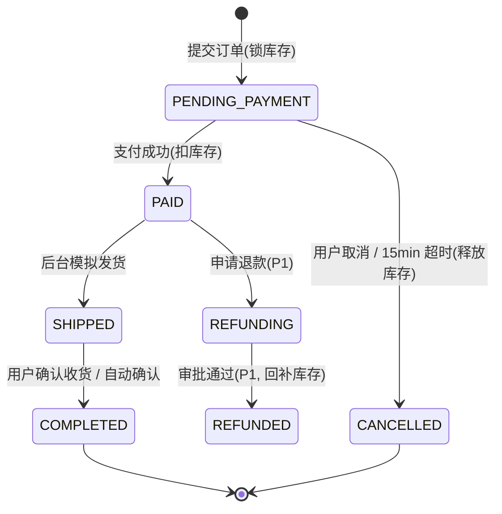

# AI 电商 Demo — MVP 落地规划（提案 v0.2，待讨论）

> ⚠️ **已归档（2026-08-22）**：本稿为扩展范围版（含 AI 导购 P0、对外 MCP、4–5 周节奏）。项目已收敛为「24–30 小时、10 分钟演示、以展示 AI 协作过程为重点」，现行规划见 [../01-MVP落地规划.md](../01-MVP落地规划.md) 与仓库根目录 `IMPLEMENTATION_BRIEF.md`。保留本稿仅作范围讨论的历史记录。


> 文档状态：**v0.2 提案稿（2026-08-22，已按三份调研校准版本与数据源）**，用于我们讨论定稿；第 11 节列出了需要拍板的决策点。
> 依据：[01-电商平台功能与用例调研](../../research/01-电商平台功能与用例调研.md)、[02-提效工具与 skills 调研](../../research/02-提效工具与skills调研.md)、[03-技术栈与开源参考调研](../../research/03-技术栈与开源参考调研.md)。

---

## 0. 一页纸摘要（TL;DR）

| 项 | 结论 |
|---|---|
| 一句话定位 | 一个**能真实跑通「找商品 → 加购 → 下单 → 模拟支付 → 看订单」闭环**、并且**可以用自然语言完成这一切**的 Web 电商 Demo |
| 三条主线 | ① 买家闭环（不缩水）② 卖家最小后台（让状态机走得完）③ AI 导购（核心卖点：对话搜索、对比、代加购、代下单需确认、订单问答）+ 对外 MCP |
| 不做的事 | 真实支付网关、真实物流、多商户结算、营销玩法（秒杀/拼团/直播）、移动端 App、推荐算法、图搜/试穿 |
| 推荐技术栈 | Next.js 16 (App Router) + TypeScript + Tailwind v4 + shadcn/ui + Drizzle + PostgreSQL（Docker / Neon）+ Better Auth + Vercel AI SDK v7 + Claude 5 + MCP TS SDK v2（版本明细见 03 调研 §3.1） |
| 规模 | 单仓、单商户（平台自营）、中文商品 ≈ 100 SPU / 300+ SKU / 3 级类目、演示账号一键登录 |
| 节奏 | 5 个里程碑（M0 基建 → M1 商品与浏览 → M2 购物车·结算·订单 → M3 后台 → M4 AI 导购 → M5 MCP·打磨·验收），每个里程碑有明确 DoD |
| 第一个可演示版本 | M2 结束即可演示完整买家闭环；M4 结束即可演示「AI 帮我买」 |

---

## 1. 我们想做成什么样

### 1.1 目标与成功标准

- **展示价值**：5 分钟内向任何人演示「一个像模像样的电商站」+「一个真的能干活的 AI 导购」。
- **工程价值**：核心电商能力是真实实现（库存原子扣减、订单状态机、价格快照、支付回调幂等），不是假按钮。
- **叙事价值**：与 2025–2026 年 Agentic Commerce 趋势对齐——店铺能力以**工具/协议接口**暴露（站内 Agent 与对外 MCP 共用同一套工具），AI 不算钱、不碰支付，用户确认后才下单。
- **成功标准（验收时逐条勾选）**：
  1. 新用户进站后无需任何说明即可完成一笔订单并看到状态流转到「已完成」。
  2. 对 AI 说「帮我找 300 元以内适合跑步的蓝牙耳机，加两个到购物车」能正确执行并在对话里看到商品卡/购物车卡。
  3. 对 AI 说「下单寄到默认地址」会生成订单预览，用户点「确认并支付」后走模拟支付，订单 `channel = ai_assistant`。
  4. 并发 50 次下单同一 SKU（库存 10）不超卖。
  5. 外部 MCP 客户端（Claude Desktop / Claude Code）能 `search_catalog → create_cart → create_checkout` 拿到支付链接（M5）。

### 1.2 目标用户与场景

| 角色 | 场景 | 入口 |
|---|---|---|
| 买家（演示账号） | 逛、搜、比、买、查订单、问 AI | Web 前台（响应式，桌面为主、手机可看） |
| 运营/管理员 | 上下架、改库存、模拟发货、看订单 | `/admin` 最小后台 |
| 外部 Agent | 通过 MCP 逛店、建购物车、拿结账链接 | `/api/mcp`（Streamable HTTP） |

### 1.3 非目标（明确不做）

真实支付与物流对接、多商户入驻与结算、营销活动（秒杀/拼团/满减叠加）、评价图片上传、客服工单、推荐算法、图搜/AI 试穿、移动端 App、国际化多币种。（以上均在调研中标为 P1/P2，后续按需迭代。）

---

## 2. 范围取舍：MVP 必做清单

> 从调研 01 的 P0/P1/P2 浓缩。**P0 = MVP 必做**；**P1 = MVP 后第一批迭代**；**P2 = 不排期**。

| # | 模块 | MVP（P0） | 第一批迭代（P1） | 不排期（P2） |
|---|---|---|---|---|
| 1 | 账号 | 演示账号一键登录/登出；邮箱+密码登录；当前用户信息 | 游客购物车合并、个人资料编辑 | 第三方登录、手机验证码 |
| 2 | 首页 | Banner、类目入口、2~3 个商品楼层（JSON 配置） | 「猜你喜欢」简单规则 | 个性化信息流、直播/游戏化 |
| 3 | 类目与搜索 | 3 级类目树、商品列表分页、关键词搜索、类目/价格区间筛选、排序（综合/销量/价格/新品） | 搜索联想、同义词、属性筛选 | 图搜 |
| 4 | 商品详情 | 图集、标题/副标题、价格（原价/现价）、规格联动选 SKU、库存提示、加购/立即购买、详情富文本、评价列表（seed） | 评价发布、AI 评价摘要、相似商品 | 问大家、AR/试穿 |
| 5 | 购物车 | 加购合并、改数量（≤库存、≤限购）、删除、选中/全选、失效商品标识、合计 | 凑单提示、收藏夹 | 跨店分组、降价提醒 |
| 6 | 地址 | 新增/编辑/删除/默认地址；省市区三级（静态 JSON） | 地址标签 | 海外地址 |
| 7 | 结算 | 订单确认页：商品快照、地址、固定运费/包邮门槛、金额明细、备注、提交订单 | 优惠券（固定金额+门槛） | 发票、积分、运费模板 |
| 8 | 库存 | 提交订单原子锁库存 → 支付成功扣减 → 取消/超时释放；InventoryLog | 库存预警 | 多仓 |
| 9 | 支付 | 模拟支付页（成功/失败按钮）、15 分钟倒计时、回调幂等、超时自动取消 | 多支付方式 UI | 真实网关 |
| 10 | 订单 | 列表（Tab：全部/待付款/待发货/待收货/已完成/已取消）、详情、状态机、取消、确认收货、再次购买 | 退款申请+审批、Mock 物流轨迹 | 换货、平台介入 |
| 11 | 最小后台 | 商品列表/上下架/改库存改价、SKU 编辑、订单列表/详情/模拟发货、几张统计卡片 | 新建商品（含规格生成 SKU）、Banner 配置 | 数据看板、营销配置 |
| 12 | AI 导购 | 聊天抽屉（全局）+ `/assistant` 页；工具：搜商品、看详情、对比、加购、看购物车、创建结算(需确认)、查订单；对话内渲染商品卡/购物车卡/订单卡；渠道归因 | 导购场景预设（送礼/穿搭）、AI 评价摘要、退货代办、价格追踪 | 商家侧 AI、图搜 |
| 13 | 对外 MCP | （M5）复用同一套工具的 MCP Server | Agent 信任层级/限流 | UCP/ACP 对接 |

---

## 3. 演示脚本（Demo Script，≈5 分钟）

1. **进站**（首页）：Banner、类目、楼层 → 点「蓝牙耳机」类目 → 列表筛选「200–500 元」按销量排序。
2. **详情**：选「黑色 / 标准版」→ SKU 价格与库存变化 → 加购 → 角标 +1。
3. **AI 登场**：打开右下角助手：「帮我找 300 元以内适合跑步的蓝牙耳机，要防水」→ 返回 3 张商品卡 →「把第 1 和第 3 个对比一下」→ 对比表 →「第 1 个加 2 个到购物车」→ 购物车卡。
4. **结算**：购物车 → 去结算 → 未登录 → 一键演示登录 → 选地址 → 提交订单 → 支付页倒计时 → 「模拟支付成功」→ 订单详情「待发货」。
5. **AI 代下单**：回到助手：「再买一副一样的寄到公司地址」→ 订单预览卡（商品/地址/金额）→ 点「确认并支付」→ 支付页 → 成功。
6. **后台**：`/admin` → 订单列表 → 「模拟发货」→ 前台订单变「已发货」→「确认收货」→「已完成」。
7. **订单问答**：「我的耳机到哪了？」→ AI 读取订单/物流回答。
8. **（M5）外部 Agent**：在 Claude Desktop 里连上 `/api/mcp`，说「在这家店找一副耳机并生成结账链接」。

---

## 4. 页面与信息架构

### 4.1 买家端

| 路由 | 页面 | 关键组件 |
|---|---|---|
| `/` | 首页 | Banner 轮播、类目宫格、商品楼层、搜索框、AI 入口 |
| `/search?q=&cat=&min=&max=&sort=` | 搜索/列表 | 筛选栏、排序、商品卡、分页 |
| `/c/[slug]` | 类目页 | 同上（按类目） |
| `/p/[id]` | 商品详情 | 图集、规格选择器、价格/库存、加购/立即购买、详情 Tab、评价 Tab |
| `/cart` | 购物车 | 条目列表、全选、数量步进、失效区、合计、去结算 |
| `/checkout` | 结算 | 地址选择/新增、商品快照、金额明细、提交 |
| `/pay/[orderNo]` | 模拟支付 | 倒计时、支付方式、成功/失败按钮 |
| `/orders` `/orders/[orderNo]` | 订单列表/详情 | 状态 Tab、状态条、取消/确认收货/再次购买 |
| `/account` `/account/addresses` | 个人中心/地址 | 基本信息、地址 CRUD |
| `/login` | 登录 | 演示账号一键登录、邮箱密码 |
| `/assistant` + 全局抽屉 | AI 导购 | 消息流、商品卡/对比卡/购物车卡/订单预览卡、确认按钮 |

### 4.2 后台（`/admin`，管理员角色）

| 路由 | 页面 |
|---|---|
| `/admin` | 统计卡片（今日订单、GMV、待发货、AI 渠道订单占比） |
| `/admin/products` `/admin/products/[id]` | 商品列表（上下架）、商品/SKU 编辑（价格、库存） |
| `/admin/orders` `/admin/orders/[orderNo]` | 订单列表、详情、模拟发货、取消 |
| `/admin/banners`（P1） | 首页配置 |

---

## 5. 数据模型（摘要）

> 完整字段见调研 01 第 6 节。金额一律用整数「分」。商品/SKU 软删除（状态位）。

```mermaid
erDiagram
  USER ||--o{ ADDRESS : has
  USER ||--|| CART : has
  USER ||--o{ ORDER : places
  USER ||--o{ REVIEW : writes
  CATEGORY ||--o{ CATEGORY : children
  CATEGORY ||--o{ PRODUCT : contains
  PRODUCT ||--o{ PRODUCT_ATTRIBUTE : defines
  PRODUCT ||--o{ SKU : variants
  PRODUCT ||--o{ REVIEW : receives
  CART ||--o{ CART_ITEM : contains
  SKU ||--o{ CART_ITEM : referenced
  ORDER ||--o{ ORDER_ITEM : contains
  ORDER ||--o{ PAYMENT : attempts
  ORDER ||--o| SHIPMENT : ships
  SKU ||--o{ ORDER_ITEM : snapshot_of
  SKU ||--o{ INVENTORY_LOG : logs
  USER ||--o{ CHAT_SESSION : chats
  CHAT_SESSION ||--o{ CHAT_MESSAGE : has

  PRODUCT { string id PK; string category_id FK; string title; string brand; json images; text detail_html; enum status; int min_price; int sales_count; float rating_avg }
  SKU { string id PK; string product_id FK; json spec; int price; int original_price; int stock; int locked_stock; string image; enum status }
  ORDER { string id PK; string order_no UK; string user_id FK; enum status; int total_amount; int discount_amount; int freight; int pay_amount; json address_snapshot; enum channel; datetime expire_at; datetime paid_at; datetime shipped_at; datetime completed_at; datetime cancelled_at }
  ORDER_ITEM { string id PK; string order_id FK; string sku_id FK; string title_snapshot; json spec_snapshot; string image_snapshot; int unit_price_snapshot; int quantity; int subtotal }
  PAYMENT { string id PK; string order_id FK; enum method; int amount; enum status; string transaction_no UK; datetime paid_at }
```

**MVP 实体清单**：User、Address、Category、Product、ProductAttribute、SKU、Cart、CartItem、Order、OrderItem、Payment、Shipment、InventoryLog、Review（seed 只读）、Banner/HomeSection（JSON 配置即可）、ChatSession/ChatMessage。
**P1 预留**：Coupon/UserCoupon、Favorite、AfterSale、PriceWatch。
**预留字段**：`Product.shop_id`（将来多商户）、`Order.channel`（web / ai_assistant / mcp）。

---

## 6. 关键业务规则

### 6.1 订单状态机



每次迁移：校验前置状态 → 事务内更新订单 + 写时间戳 + 库存动作 + InventoryLog。

### 6.2 库存（防超卖底线）

| 时机 | SQL 语义 | 备注 |
|---|---|---|
| 提交订单 | `UPDATE sku SET locked_stock = locked_stock + :q WHERE id = :id AND stock - locked_stock >= :q`；影响行数为 0 → 库存不足 | 事务内逐 SKU 执行；任一失败整单回滚 |
| 支付成功 | `stock -= q, locked_stock -= q` | 由支付回调触发，幂等 |
| 取消 / 超时 | `locked_stock -= q` | 定时任务 + 访问时惰性检查双保险 |
| 退款（P1） | `stock += q` | — |

### 6.3 价格与快照

- 购物车显示**实时**价格/库存，并在变动时提示；结算预览与提交订单由服务端重新计算。
- OrderItem 保存标题/规格/图片/单价快照；Order 保存地址快照；历史订单不受商品改价/下架影响。

### 6.4 支付（模拟）

- 提交订单同时创建 `Payment(INIT)`；支付页选择方式后调用 `POST /api/pay/mock/callback`（带 `transaction_no`）。
- 回调幂等：同一 `transaction_no` 重复回调直接返回成功；订单已 PAID 的回调直接返回成功；已取消订单的回调记录异常并拒绝。
- 倒计时 15 分钟；到期订单由 cron（或请求时惰性）置为 CANCELLED 并释放库存。

### 6.5 购物车约束

- `CartItem` 唯一键 `(cart_id, sku_id)`，重复加购合并数量；数量 ≤ `min(可售库存, 单品限购)`；购物车总条数 ≤ 100。
- 查询购物车时 join SKU 实时状态：下架/售罄标记 `invalid`，禁止勾选；结算时再次校验。

---

## 7. AI 导购设计

### 7.1 原则

1. **一套工具，两个入口**：站内 Agent（聊天抽屉 / `/assistant`）与对外 MCP Server 共用 `src/server/services/*`，工具层只是薄封装。
2. **模型不算钱**：价格、优惠、库存、运费一律服务端计算并返回结构化结果；LLM 只负责理解意图、选工具、解释结果。
3. **代下单必须有用户确认**：`create_checkout` 只产生「订单预览」（相当于 AP2 的 Cart Mandate），用户在 UI 点「确认并支付」才真正创建订单并进入支付；AI 永远不触发支付。
4. **渠道归因**：`Order.channel ∈ {web, ai_assistant, mcp}` 第一天就加。
5. **可观测**：记录每轮工具调用（名称、参数、耗时、结果摘要）便于评测与演示。

### 7.2 最小工具集（命名对齐 Shopify/UCP 风格）

| 工具 | 输入 | 输出 | 副作用 |
|---|---|---|---|
| `search_catalog` | query, category?, price_min?, price_max?, sort?, limit | 商品摘要列表（id/标题/价格区间/图/销量/评分） | 无 |
| `get_product` | product_id | 详情 + 属性 + SKU 列表（价格/库存） | 无 |
| `compare_products` | product_ids[] (2–4) | 规格/价格/评分对比矩阵 | 无 |
| `get_cart` | — | 购物车条目与合计 | 无 |
| `update_cart` | items[{sku_id, quantity}] | 更新后的购物车 | 写购物车 |
| `get_addresses` | — | 地址列表（含默认） | 无 |
| `create_checkout` | sku_ids 或 use_cart, address_id | **订单预览**（商品/地址/金额/运费）+ `checkout_token` | 无（确认后才建单） |
| `confirm_checkout`（仅 UI 按钮触发） | checkout_token | order_no + 支付链接 | 建单、锁库存 |
| `get_orders` / `get_order` | status? / order_no | 订单列表/详情 + 物流 | 无 |
| `request_return`（P1） | order_no, item, reason | 售后单 | 写售后 |

### 7.3 交互形态

- **Generative UI**：工具结果渲染为组件——商品卡（可点进详情/一键加购）、对比表、购物车卡（可改数量）、订单预览卡（含「确认并支付」按钮）、订单状态卡。
- **上下文注入**：当前用户、当前页面（在某商品页时自动带上 product_id）、购物车摘要、默认地址。
- **降级**：模型不可用时助手显示「仅支持关键词搜索」并调用同一 `search_catalog`。

### 7.4 对外 MCP（M5）

- 路由 `/api/mcp`（Streamable HTTP），暴露 `search_catalog / get_product / create_cart / get_cart / update_cart / create_checkout(返回结账 URL)`；订单与支付仍回到 Web 完成（与 Shopify Checkout MCP「高信任 Agent 才可直接购买」的思路一致，Demo 只做「拿结账链接」）。
- 鉴权：MVP 用 API Key（demo），后续可换 OAuth。

### 7.5 评测（最小）

- 20 条固定对话用例（搜索/对比/加购/下单/查订单/越权尝试如「直接付钱」）→ 断言工具调用序列与参数；用 Vitest 跑；后续可接 Promptfoo。

---

## 8. 技术栈（推荐，版本以 03 调研为准）

| 层 | 选型 | 理由 |
|---|---|---|
| 框架 | **Next.js 16.3 (App Router)** + TypeScript | 单仓同构、Server Actions/Route Handlers 直接做 API、Claude Code 对其最熟、生态最全；前后端一体对 Flutter 背景最友好（一个工程、一种语言） |
| UI | Tailwind CSS **v4** + shadcn/ui（CLI + **shadcn MCP**）+ `motion` 点缀（+ frontend-design skill） | 组件可控、AI 可经 MCP 直接装组件、生成质量高、主题/暗色一致 |
| 数据 | **Drizzle ORM 0.45 + PostgreSQL（本地 Docker Compose / 线上 Neon）**；备选 SQLite(libSQL) | Drizzle 贴近 SQL，原子 UPDATE/事务表达直接，`drizzle-zod` 可把表 schema 直接变成 AI 工具的 inputSchema；Postgres 有 JSONB 存规格、`pg_trgm` 做中文模糊搜索、pgvector 留路；SQLite 作「零依赖跑起来」备选（Drizzle 切方言成本低） |
| 鉴权 | **Better Auth 1.7**（邮箱密码 + 会话，Drizzle adapter）+ 演示账号一键登录 | Auth.js v5 仍 beta；Better Auth 文档完整、开箱即用 |
| AI | **Vercel AI SDK v7** + `@ai-sdk/anthropic`（`claude-sonnet-5` 主 / `claude-opus-5` 或 `claude-fable-5` 备 / `claude-haiku-4-5` 轻量）+ tool calling（`toolApproval` 做下单确认）+ 客户端按 tool part 渲染卡片 + **AI Elements**（含 `Confirmation` 组件） | 流式、工具、HITL 审批、对话 UI 一站式；RSC `streamUI` 仍 experimental 不用；模型可配置 |
| MCP | MCP TS SDK **v2**（`@modelcontextprotocol/server`，Streamable HTTP，挂在 Next 路由 `/api/mcp`） | 复用 service 层；Claude Code 用 `claude mcp add --transport http shop http://localhost:3000/api/mcp` 联调 |
| 搜索 | Postgres `ILIKE` / `pg_trgm` + 结构化过滤，LLM 负责把自然语言改写成过滤条件（MVP）；pgvector（P1，商品 >2k 或语义查询明显失败时再上） | MVP 不上向量，先把结构化字段做全 |
| 任务 | 订单超时：Next cron 路由 + 惰性检查 | 简单够用 |
| 测试 | **Vitest 4** + Testing Library（service 层/组件）、**Playwright**（E2E 主路径；日常用 Playwright CLI+Skills 省 token）、MSW 2（Mock 模型）、**Promptfoo**（AI 工具调用回归评测） | 见 02 调研 |
| 部署 | 本地 Docker Compose（Postgres + app）为主；公网演示 Vercel + Neon；国内直连可用 Zeabur 跑同一镜像 | 见 03 调研 |

**不选 Medusa/Saleor 等现成后端的原因**：Demo 要展示的是「自己实现的电商内核 + AI」，现成平台会把数据模型与状态机藏起来，AI 工具层还要绕它们的 API；但**会抄它们的模型与接口命名**（见 03 调研）。

---

## 9. 里程碑与 DoD

| 里程碑 | 内容 | DoD（完成定义） |
|---|---|---|
| **M0 基建**（~2 天） | 仓库初始化、Next + TS + Tailwind + shadcn、Drizzle + Postgres(Docker)、CLAUDE.md / .claude/rules / hooks、lint/format/test 脚手架、seed 脚本（AI 生成中文商品数据 + 图片）、CI | `pnpm dev` 一键起；`pnpm db:seed` 灌 100 SPU；CI 绿 |
| **M1 商品与浏览**（~4 天） | 首页、类目、搜索/筛选/排序、商品详情（规格联动）、登录 | 演示脚本 1–2 步可走；Playwright 覆盖首页→详情 |
| **M2 购物车·结算·订单**（~5 天） | 购物车、地址、结算预览、提交订单（锁库存）、模拟支付（回调幂等/超时）、订单列表/详情/取消/确认收货 | 演示脚本 4 可走；并发下单不超卖测试通过；状态机单测 |
| **M3 最小后台**（~2 天） | 商品上下架/库存价格、SKU 编辑、订单发货、统计卡片、角色鉴权 | 演示脚本 6 可走 |
| **M4 AI 导购**（~5 天） | 聊天抽屉 + `/assistant`、工具集、Generative UI 卡片、订单预览确认流、渠道归因、20 条评测用例 | 演示脚本 3/5/7 可走；评测用例通过 ≥ 90% |
| **M5 MCP·打磨·验收**（~3 天） | `/api/mcp`、Claude Desktop 联调、性能/可访问性过一遍（web-perf）、README + FINAL_ACCEPTANCE + 截图/GIF | 演示脚本 8 可走；验收清单全勾 |

> 时长按「1 人 + Claude Code、每天 3~4 小时有效投入」粗估，合计约 4~5 周；若全职可压缩到 2~3 周。

---

## 10. 工程与协作规范（摘要，细节见 02 调研）

- **仓库结构**（单仓 Next.js，细节见 03 调研 §6）：

  ```text
  demo-e-commerce/
  ├─ docs/{research,plan,adr}/
  ├─ src/app/            # 页面与路由（(shop)/ (admin)/ api/chat api/mcp api/pay ...）
  ├─ src/components/     # UI（shadcn + 业务组件 + AI 卡片）
  ├─ src/server/
  │  ├─ db/              # drizzle schema、client
  │  ├─ services/        # catalog / cart / order / payment / inventory / user（不 import Next / AI / MCP）
  │  └─ dto/             # zod 输入输出类型（Web / AI / MCP 共用）
  ├─ src/ai/
  │  ├─ tools/           # ToolDef 定义（基于 services + dto）
  │  ├─ registry.ts      # 白名单 → toAiSdkTools() / toMcpTools() 双适配；支付与售后不进 registry
  │  └─ prompts/
  ├─ src/mcp/            # /api/mcp 的 server 组装
  ├─ drizzle/            # migrations
  ├─ scripts/seed/       # DummyJSON 拉取 → Claude 生成中文文案/SKU → 入库
  ├─ tests/{unit,e2e,ai} # Vitest / Playwright / Promptfoo
  ├─ docker-compose.yml  # postgres (+ app)
  └─ CLAUDE.md, .claude/{rules,agents,settings.json}
  ```
  service 层只依赖 db + dto，被 Server Actions / Route Handlers、AI tools、MCP tools 三方复用；`paymentService.mockPay()` 只由 `/api/pay` 调用，代码层面不进 AI registry。
- **Claude Code 配置**：`CLAUDE.md`（<200 行：命令、约定、禁区）+ `.claude/rules/*.md` 按目录；PostToolUse hook 自动 format/lint；`code-reviewer` subagent；`security-guidance`、`typescript-lsp`、`frontend-design`、`playwright` 插件；轻量 spec 流程（OpenSpec）或只用 docs/plan 做任务拆分。
- **分支与提交**：main 保护、feature 分支、Conventional Commits；每个里程碑一个 tag。
- **文档流转**：本仓库 `docs/` 为唯一事实源；需要协作时用 lark-doc 同步规划、lark-task 建里程碑任务、lark-im 发进展；架构图用 Mermaid 入库。
- **ADR**：重大选型（DB、鉴权、AI SDK）各写一条 `docs/adr/NNNN-*.md`。

---

## 11. 需要你拍板的决策点

| # | 决策 | 选项 | 我的建议 | 影响 |
|---|---|---|---|---|
| D1 | 市场与语言 | A 中文商品/人民币（淘宝风）｜B 英文/美元（Amazon 风）｜C 双语 | **A**（受众与你我都是中文；UI 文案可预留 i18n） | seed 数据、UI 文案 |
| D2 | 技术栈 | A Next.js 一体｜B 前后端分离｜C Medusa 起步 | **A** | 整体 |
| D3 | 数据库 | Postgres(Docker)｜SQLite(libSQL) | **Postgres**，SQLite 作备选 | 搜索、并发语义、部署 |
| D4 | 商户模型 | 单商户（平台自营）｜多商户（购物车按店分组） | **单商户**，模型预留 `shop_id` | 购物车/结算复杂度 |
| D5 | 登录 | 演示账号一键登录 + 邮箱密码｜真实注册流程 | **前者** | M1 工作量 |
| D6 | AI 入口 | 全局抽屉｜独立页｜两者 | **两者**（抽屉为主） | M4 |
| D7 | 对外 MCP | 做（M5）｜不做 | **做** | M5 |
| D8 | 后台 | 最小后台页面｜只用 seed+脚本 | **最小后台** | M3 |
| D9 | 部署 | 仅本地 Docker｜+Vercel 公网 | **本地为主，M5 视情况上 Vercel** | 成本/演示便利 |
| D10 | 流程工具 | OpenSpec｜superpowers｜只用 docs/plan | **OpenSpec 或只用 docs/plan**（二选一即可） | 日常开发方式 |
| D11 | 商品数据 | A 纯 AI 生成中文商品 + 占位图｜B DummyJSON 英文直接用｜C **DummyJSON 骨架（194 件 / 24 类、白底商品图）→ Claude 离线生成中文文案 + 多规格 SKU → 快照入库** | **C**（图片真实、类目现成、文案中文；再人工润色 20 个主推商品） | seed 脚本 |
| D12 | 模型 | `claude-sonnet-5` 为主（$3/$15，8/31 前 $2/$10）、复杂对比/长上下文用 `claude-opus-5`｜全用 Opus｜其它 | **Sonnet 主 + Opus 备，环境变量可切** | 成本/质量 |

---

## 12. 风险与应对

| 风险 | 应对 |
|---|---|
| 范围膨胀（想做营销/多商户/真实支付） | 严格按第 2 节 P0 执行；P1 进 backlog |
| AI 工具调用不稳定（选错工具/参数） | 工具描述写清、参数 schema 严格、20 条评测用例回归、失败时回退到关键词搜索 |
| 并发/库存 bug | service 层单测 + 并发压测脚本进 CI |
| 商品数据「假感」重 | AI 生成时给足品牌/规格/卖点模板 + 统一风格图片；挑 20 个主推商品人工润色 |
| 使用额度/时间 | 每个里程碑独立可演示；优先 M1–M2 闭环，再 M4 |

---

## 附录 A：演示数据规划

- 类目：数码（耳机/手机/配件）、家电、服饰（男/女/童）、美妆、食品、家居、运动、图书 → 3 级树、约 20 个叶子类目。
- 商品：≈100 SPU，每 SPU 2–6 SKU（颜色/尺码/版本），价格 9.9–6999 元，含 10% 低库存（≤3）与 3% 售罄用于演示失效/限购。
- 用户：`demo@shop.local`（买家）、`admin@shop.local`（管理员），各带 2 个地址；买家预置 3 笔不同状态订单。
- 评价：每个主推商品 5–20 条，用于 AI 评价摘要（P1）。
