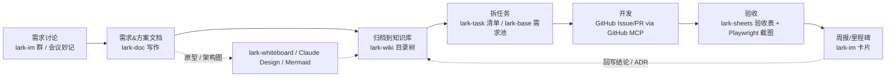

# 提效工具与 Skills 调研（开发 / 设计 / 测试 / AI 工具链 / 沟通协作）

> 文档状态：v1（2026-08-21 调研稿）｜所属：demo-e-commerce / docs/research ｜ 配套文档：[01-电商平台功能与用例调研](01-电商平台功能与用例调研.md)、[03-技术栈与开源参考调研](03-技术栈与开源参考调研.md)、[MVP 落地规划](../plan/01-MVP落地规划.md)
> 说明：所有安装命令均以官方 README / 文档为准核实；无法核实处标「待核实」。推荐度 ★~★★★★★ 为「对本 Demo 项目」的相对推荐度。

---

## 第一部分：开发效率（Claude Code skills / plugins / 流程工具）


### A. anthropics/skills（官方 Agent Skills 仓库）
- **是什么**：Anthropic 官方 skill 示例库 + Agent Skills 规范（`spec/`）+ 模板（`template/`）。`skills/` 下实际目录（19 个）：`academy-guide, algorithmic-art, brand-guidelines, canvas-design, claude-api, discernment-nudge, doc-coauthoring, docx, frontend-design, internal-comms, mcp-builder, pdf, pptx, skill-creator, slack-gif-creator, theme-factory, web-artifacts-builder, webapp-testing, xlsx`（注意：是 `web-artifacts-builder`，不是 artifacts-builder）。
- **解决什么**：给 Claude 可动态加载的领域流程（文档生成、前端审美、Playwright 测试、MCP 构建、写 skill）。
- **安装（README 原文，已核实）**：
  ```
  /plugin marketplace add anthropics/skills
  /plugin install document-skills@anthropic-agent-skills
  /plugin install example-skills@anthropic-agent-skills
  ```
  README **未提及** `npx skills add` 或手动复制到 `~/.claude/skills`；但二者实际可行（Vercel CLI 可扫描任意含 SKILL.md 的仓库，skills.sh 榜单上 `anthropics/frontend-design` 已 80 万+ 安装）。另：`frontend-design`、`skill-creator` 已单独进入 `claude-plugins-official`，可 `/plugin install frontend-design@claude-plugins-official`。
- **适用阶段**：UI 实现（frontend-design）、E2E 测试（webapp-testing）、写自定义 skill（skill-creator）。
- **推荐度 ★★★★☆**：官方、低风险；但 example-skills 一次装 19 个会占上下文，建议只装 frontend-design / webapp-testing / skill-creator。
- **注意**：docx/pdf/pptx/xlsx 是 source-available 非开源；skill 频繁触发时用 `disable-model-invocation`。
- 来源：https://github.com/anthropics/skills

### B. Vercel skills CLI / skills.sh
- **是什么**：开源 CLI（npm 包 `skills`，当前 v1.5.23），跨 75+ agent 安装/发现 SKILL.md；skills.sh 是配套目录与榜单。
- **命令（README 已核实）**：`npx skills add <owner/repo>`；flags：`-g/--global`（装到 `~/.claude/skills/`，默认项目级 `.claude/skills/`）、`-a/--agent claude-code`、`-s/--skill <name>`、`-y`、`-l/--list`、`--all`、`--copy`（默认 symlink 到规范副本）；子命令 `use / list / find / remove / update / init`。示例：`npx skills add vercel-labs/agent-skills -a claude-code -g`。
- **适用阶段**：全程，任何想快速试用社区 skill 的时候。
- **推荐度 ★★★★☆**：装卸最快、支持 Claude Code；但质量参差，需自己审阅 SKILL.md。
- **注意**：默认 symlink，Windows/某些容器用 `--copy`；安装即信任第三方指令，属提示注入面。
- 来源：https://github.com/vercel-labs/skills 、https://skills.sh

### C. obra/superpowers
- **是什么**：Jesse Vincent 的「强制流程」skill 库，当前 **v6.3.0（2026-08-12）**，MIT。`skills/` 实际 14 个：`brainstorming, writing-plans, executing-plans, subagent-driven-development, dispatching-parallel-agents, test-driven-development, systematic-debugging, verification-before-completion, requesting-code-review, receiving-code-review, using-git-worktrees, finishing-a-development-branch, writing-skills, using-superpowers`。
- **工作流**：brainstorming → worktree 隔离 → writing-plans（2–5 分钟粒度任务）→ subagent-driven-development（每任务新 subagent + 两阶段审查）→ 红绿 TDD → code review → finishing branch。
- **安装（README 已核实，两种均有效）**：
  ```
  /plugin install superpowers@claude-plugins-official        # 官方市场（已确认收录，pin 到 commit）
  # 或
  /plugin marketplace add obra/superpowers-marketplace
  /plugin install superpowers@superpowers-marketplace
  ```
- **适用阶段**：需求澄清 → 计划 → 实现全流程。
- **推荐度 ★★★★☆**：对「先想清楚再写、带 TDD」非常有效；但流程偏重，小改动会被强制 brainstorm，需口头跳过。
- **注意**：SessionStart hook 注入 `using-superpowers`；brainstorming 可选的视觉伴侣会远程加载 logo 带版本号（遥测），`SUPERPOWERS_DISABLE_TELEMETRY=1` 关闭；与其他流程类插件（BMAD/spec-kit）同装会冲突。
- 来源：https://github.com/obra/superpowers 、https://github.com/obra/superpowers/releases

### D. 官方 plugin marketplace（claude-plugins-official）
- **安装语法（文档已核实）**：首次交互启动自动注册该 marketplace；`/plugin install <name>@claude-plugins-official`；CLI 存在：`claude plugin install <name>@<marketplace> [--scope user|project|local] [--yes]`、`claude plugin marketplace add/update`、`claude plugin list/details/validate/init`。安装后按提示 `/reload-plugins`。社区市场另行添加：`/plugin marketplace add anthropics/claude-plugins-community` → `@claude-community`。
- marketplace.json 当前共 **286** 个插件（`plugins/` 官方 + `external_plugins/` 第三方）。与 Web 开发/审查/测试相关：

| 插件 | 作用 | 推荐 |
|---|---|---|
| feature-dev | 探索→架构→实现→质量审查的多 agent 特性开发流 | ★★★★ |
| code-review | 多 agent PR 审查，置信度打分过滤误报 | ★★★★ |
| pr-review-toolkit | 注释/测试/错误处理/类型设计/简化等专项审查 agent | ★★★ |
| commit-commands | `/commit-commands:commit`、push、建 PR | ★★★★ |
| hookify | 用 markdown 规则快速生成「禁止某行为」hook | ★★★ |
| claude-md-management | 审计/精简 CLAUDE.md、沉淀会话学习 | ★★★ |
| claude-code-setup | 分析代码库，推荐 hooks/skills/MCP/subagent | ★★★ |
| ralph-loop | Ralph Wiggum 式自循环，反复跑同一任务直到完成 | ★★ |
| security-guidance | 编辑时模式告警 + Stop 时 LLM diff 审查 + 提交审查（XSS/注入/SSRF/硬编码密钥等 25+ 类） | ★★★★★ |
| frontend-design | 生成非「AI 味」的高质量前端 | ★★★★ |
| typescript-lsp | 接入 typescript-language-server，编辑后即时诊断/跳转（需自装二进制） | ★★★★★ |
| serena（external） | 基于 LSP 的语义代码分析/重构 MCP | ★★★ |
| playwright（external） | 微软浏览器自动化 MCP，E2E | ★★★★ |
| mattpocock-skills（external，github 源） | grill-me、TDD、spec/ticket、代码审查、领域建模 | ★★★★ |
| modern-web-guidance（external，GoogleChrome） | 最新 Web 最佳实践指引 | ★★★ |
| skill-creator | 创建/评测 skill（从 anthropics/skills 移入） | ★★★ |
| superpowers（external，url 源） | 同 C | ★★★★ |

- 来源：https://code.claude.com/docs/en/discover-plugins 、https://code.claude.com/docs/en/plugins 、https://github.com/anthropics/claude-plugins-official

### E. Spec-driven 工具

| 工具 | 最新版 | 安装（已核实） | 命令 | 适合规模 |
|---|---|---|---|---|
| **GitHub spec-kit** | **v1.0.1（2026-08-21）** | `uv tool install specify-cli --from git+https://github.com/github/spec-kit.git@v1.0.1`（或 PyPI `uv tool install specify-cli`）；`specify init <proj> --integration claude`（**注意：当前 README 用 `--integration`，不是 `--ai`**，`--ai` 未见于 README，标「待核实是否仍兼容」）；需 Python 3.11+、uv | `/speckit.constitution → specify → (clarify) → plan → tasks → (analyze/checklist) → implement → converge`，另有 `/speckit.taskstoissues` | 中大型、新项目、多人；阶段门槛重 |
| **OpenSpec** | **v1.10.0（2026-08-19）** | `npm install -g @fission-ai/openspec@latest` → `openspec init`（Node ≥20.19）；`openspec update` 刷新指令 | 默认 `/opsx:explore`、`/opsx:propose`、`/opsx:apply`、`/opsx:archive`；扩展 `/opsx:new /continue /ff /verify /bulk-archive /onboard`（旧 `/openspec:proposal` 系已被 opsx 取代） | 小中型、brownfield、迭代式 |
| **BMAD-METHOD** | **v6.11.0（2026-08-10，非预发布，v6 已稳定）** | `npx bmad-method install`（Node 20.12+、Python 3.10+、uv） | 以 skill 形式提供：`bmad-help`、`bmad-build`（v6.11 统一实现入口）、`bmad-prd`、`bmad-architecture`、`bmad-create-epics-and-stories`、`bmad-code-review` 等；Claude Code 中具体斜杠前缀「待核实」 | 中大型、需要 PM/架构师/SM 角色的团队；Quick Flow 可缩短 |
| Kiro / Tessl | — | Kiro：AWS agentic IDE（2025-11 GA），requirements→design→tasks 三件套，绑定 IDE；Tessl：skills/spec registry（2026-01 开放），`tessl install`，偏「spec 即源码」 | — | 一句带过 |

**小型电商 Demo 建议**：选 **OpenSpec**（★★★★）：零 Python 依赖、`/opsx:propose → apply → archive` 三步即可、对已存在代码友好、spec 为纯 Markdown。spec-kit（★★★）适合从 0 起且想要宪章/任务拆分的完整流程，但 Demo 用会显得仪式感过重；BMAD（★★）角色与文档量超出 Demo 需要。若已装 superpowers，OpenSpec 与其 brainstorming/plan 有重叠，二选一。
- 来源：https://github.com/github/spec-kit 、https://github.com/Fission-AI/OpenSpec 、https://github.com/bmad-code-org/BMAD-METHOD 、https://docs.bmad-method.org/how-to/install-bmad/ 、https://martinfowler.com/articles/exploring-gen-ai/sdd-3-tools.html

### F. Hooks / Subagents / CLAUDE.md / Skills 最佳实践（官方文档已核实）
- **Hooks**（https://code.claude.com/docs/en/hooks）：配置于 `~/.claude/settings.json`、`.claude/settings.json`、`.claude/settings.local.json`、插件 `hooks/hooks.json`、skill/subagent frontmatter；handler 类型 `command / http / mcp_tool / prompt / agent`。事件（31 个）：`SessionStart, Setup, UserPromptSubmit*, UserPromptExpansion*, PreToolUse*, PermissionRequest, PermissionDenied, PostToolUse, PostToolUseFailure, PostToolBatch*, Notification, MessageDisplay, SubagentStart, SubagentStop*, TaskCreated*, TaskCompleted*, Stop*, StopFailure, TeammateIdle*, InstructionsLoaded, ConfigChange*, CwdChanged, DirectoryAdded, FileChanged, WorktreeCreate*, WorktreeRemove, PreCompact*, PostCompact, Elicitation*, ElicitationResult*, SessionEnd`（* 可阻断：exit 2 或 JSON `permissionDecision: deny`）。典型用法：`PostToolUse` matcher `Edit|Write` 跑 prettier/eslint；`PreToolUse` matcher `Bash` 拦 `rm -rf`/写 migrations；`Stop` 跑测试作为完成门槛（连续 8 次阻断后放行）；`Notification` 桌面提醒。原则：必须每次发生的事用 hook，不靠 CLAUDE.md。
- **Subagents**（/sub-agents）：`.claude/agents/*.md`（项目）、`~/.claude/agents/`（用户）、插件 `agents/`；frontmatter：`name, description`（必填）、`tools, disallowedTools, model(sonnet/opus/haiku/inherit), permissionMode, skills, memory(user/project/local), mcpServers, hooks, maxTurns, isolation: worktree, background, effort`；`/agents` 管理；内置 Explore/Plan/general-purpose。用法：大量文件检索、独立验证/对抗审查放到 subagent 保护主上下文。
- **CLAUDE.md**（/memory、/best-practices）：层级 = 托管策略 → `~/.claude/CLAUDE.md` → `./CLAUDE.md` 或 `./.claude/CLAUDE.md` → `CLAUDE.local.md`（gitignore）；**`.claude/rules/*.md` 已确认存在**（`~/.claude/rules/` 亦可），支持 frontmatter `paths: ["src/api/**/*.ts"]` 按路径懒加载；`@path` 导入（最多 4 层，外部路径首次需确认）；`@AGENTS.md` 可复用其他 agent 的规则。写法：<200 行、只写「Claude 猜不到的」构建/测试命令、与默认不同的规范、分支/PR 礼仪、环境怪癖；删掉代码可推导的内容；`/init` 生成、`/doctor` 提议裁剪、`/context` 验证已加载。
- **Skills**（/skills）：`~/.claude/skills/<name>/SKILL.md`（个人）、`.claude/skills/<name>/SKILL.md`（项目）、插件 `skills/`；`.claude/commands/*.md` 已并入 skills。frontmatter：`name, description, argument-hint, disable-model-invocation, user-invocable, allowed-tools, disallowed-tools, model, effort, context: fork, agent, background, paths, hooks, metadata, license, compatibility`；`$ARGUMENTS`/`$1`/`${CLAUDE_SKILL_DIR}`；SKILL.md 建议 <500 行，细节放附属文件。
- 原 Anthropic 博客 https://www.anthropic.com/engineering/claude-code-best-practices 已 308 重定向到 https://code.claude.com/docs/en/best-practices。

### 对本项目（小型电商 Demo）的组合建议
1. 基础：`typescript-lsp` + `security-guidance` + `commit-commands`（官方市场一行一个 `/plugin install …@claude-plugins-official`）。
2. UI：`frontend-design`；测试：`playwright` 或 anthropics `webapp-testing`。
3. 流程：OpenSpec（轻）或 superpowers（重但带 TDD）二选一。
4. 自建：项目 `CLAUDE.md`（<200 行）+ `.claude/rules/` 按目录拆分 + PostToolUse 自动 prettier/eslint hook + 一个 `code-reviewer` subagent。

### 引用 URL
https://github.com/anthropics/skills ｜ https://github.com/vercel-labs/skills ｜ https://skills.sh ｜ https://github.com/obra/superpowers ｜ https://github.com/anthropics/claude-plugins-official ｜ https://code.claude.com/docs/en/discover-plugins ｜ https://code.claude.com/docs/en/plugins ｜ https://github.com/github/spec-kit ｜ https://github.com/Fission-AI/OpenSpec ｜ https://github.com/bmad-code-org/BMAD-METHOD ｜ https://docs.bmad-method.org/how-to/install-bmad/ ｜ https://code.claude.com/docs/en/hooks ｜ https://code.claude.com/docs/en/sub-agents ｜ https://code.claude.com/docs/en/memory ｜ https://code.claude.com/docs/en/skills ｜ https://code.claude.com/docs/en/best-practices ｜ https://martinfowler.com/articles/exploring-gen-ai/sdd-3-tools.html

---

## 第二部分：设计效率 / 测试效率 / AI 交流能力开发工具链 / 沟通协作效率

> 本部分调研日期 2026-08-21/22；「商品量级 100~300」等处按 DummyJSON 假设，实际数据源按 [MVP 规划 D11](../plan/01-MVP落地规划.md) 决定（建议 AI 生成中文商品），结论不受影响。

### 1. 设计效率

#### 1.1 设计 / UI 生成工具总览

| 工具 | 是什么 | 解决什么问题 | 如何接入 / 安装（官方命令） | 适用阶段 | 推荐度 | 注意事项 |
|---|---|---|---|---|---|---|
| **Figma Dev Mode MCP Server** | Figma 官方 MCP，分 **远程**（`https://mcp.figma.com/mcp`，Streamable HTTP）和 **桌面端**（Figma Desktop 内启动）两种 | 让 Claude Code 直接读取选中图层的设计上下文（样式/变量/截图/元数据），生成贴近设计稿的代码；远程版还能用 `use_figma`/`generate_figma_design` 反向往 Figma 写设计、`generate_diagram` 把 Mermaid 变 FigJam 图 | `claude mcp add --transport http figma https://mcp.figma.com/mcp`（首次调用走 OAuth 登录）。核心工具：`get_design_context` / `get_screenshot` / `get_metadata` / `get_variable_defs` / `get_code_connect_map` / `search_design_system` / `download_assets`(远程) / `use_figma`(远程) / `generate_figma_design`(远程) / `generate_diagram`(远程) / `get_motion_context`；MCP Prompt：`create_design_system_rules` | 有设计稿时的「设计稿→代码」阶段；也可用远程版让 AI 起草 Figma 稿 | ★★★★（有 Figma 稿时）/ ★★（纯文字驱动时） | 官方帮助中心：**远程服务器对所有席位和计划开放**；**桌面端服务器需付费计划的 Dev 或 Full 席位**。桌面端本地端口官方页未给出（社区常见为 `http://127.0.0.1:3845/mcp`，待核实）。Weave 系列工具按 credit 计费。 |
| **Claude Design（本机 `design` skill）** | Claude Code 内置「设计画布」：Claude 先以 `.dc.html` 画板草稿多屏布局 → 发布为 Artifact 的画布编辑器 → 用户点选元素、属性面板微调、行内改字、撤销 → Save 发新版本 / 导出 PNG·PDF | 没有设计师时，用自然语言 5 分钟拿到可手改的 UI 草图 / 页面流程 / 海报图，避免在代码里反复试排版 | 已装，无需安装；对 Claude 说「帮我做一套电商首页/商品页/购物车/AI 导购的线框」即可触发 | 需求澄清 → 原型评审阶段（写代码前） | ★★★★ | 产物是画板 HTML 而非组件代码，落地仍需 shadcn/Tailwind 重写；适合锁定布局和信息架构，不适合做像素级设计系统。仅「创建/重新播种」走 skill，后续编辑在 Artifact 里做。 |
| **v0 by Vercel（v0.app）** | Vercel 的文字→全栈 Next.js 应用生成器（shadcn/ui + Tailwind），带可视化编辑、GitHub 同步、一键部署 Vercel；也提供模型 API | 「文字描述直接出高质量 UI」最成熟的方案，默认技术栈与本项目一致，生成即可复制到仓库 | 网页使用，无需安装；也可将生成的组件 `npx shadcn@latest add <v0-url>` 拉入项目 | 首屏/页面初稿、Landing、后台面板 | ★★★★ | 官方定价页（2026-08）：Free $0（含 $5/月额度，有每日消息上限）；Plus $30/人/月（含 $30/月额度 + 登录日 $2 免费额度）；Business $100/人/月；Enterprise 定制。模型 API：v0 Mini $0.20/$1.20，v0 Pro $2/$10，v0 Max $5/$25，v0 Max Fast $10/$50（每 1M 输入/输出 token）。生成物要过一遍 a11y/性能检查。 |
| **Google Stitch** | Google 基于 Gemini 的「文字/草图 → UI 设计」工具，可导出 HTML/CSS、粘贴到 Figma | 快速产出多方案视觉稿，尤其适合移动端/落地页探索 | 网页 `https://stitch.withgoogle.com/`（本次抓取仅拿到页面标题，细节 **待核实**：免费额度、是否有官方 MCP/API） | 视觉探索、做几版风格对比 | ★★★ | 导出的 HTML 偏静态，不是组件代码；与 Next.js 栈的衔接不如 v0。 |
| **Pencil / Pen（pencil.dev → 跳转 pen.dev）** | 口号「Design on canvas. Land in code.」：在编辑器内的设计画布，目标是设计稿与代码同源 | 在 IDE 里画 → 直接落地到代码，减少 Figma↔代码往返 | 官网仅抓到一句口号，**安装方式 / `.pen` 格式 / MCP 接入 / 定价均待核实** | 小团队原型 | ★★（待核实后再评） | 产品仍在演进，域名刚迁移，谨慎押注。 |
| **Penpot + Penpot MCP** | 开源 Figma 替代品；官方 MCP 让 LLM 读写 Penpot 文件，甚至在插件环境里执行 Plugin API 代码 | 想要可自托管、开源的设计工具 + AI 读写设计 | 仓库 `penpot/penpot-mcp` **已于 2026-02-03 归档并并入主仓库** `github.com/penpot/penpot/tree/develop/mcp`。README：需 Node 22+，`npm install && npm run bootstrap`（同时启动 MCP 服务 4401 和插件 web 服务 4400），Penpot 里加载插件 `http://localhost:4400/manifest.json`，然后 `claude mcp add penpot -t http http://localhost:4401/mcp` | 自托管 / 开源偏好团队 | ★★ | 本项目 1~2 人、无自托管需求，Figma 远程 MCP 免费且零部署，更省事。 |
| **21st.dev Magic MCP** | 21st.dev 的组件生成/检索 MCP：搜索 10k+ React/Tailwind 组件、AI 生成新 UI、找 Logo | 写组件时直接从 IDE 拉「好看的」现成组件或让 AI 生成变体 | 推荐：`npx @21st-dev/cli@latest init --client claude`；旧方式：`npx -y @21st-dev/magic@latest API_KEY="..."`；需在 21st.dev/mcp 申请 API Key（**旧 Key 已全部重置**）。工具已改名：`generate`（原 21st_magic_component_builder）、`get_inspiration`、`search_logo`，另有目录搜索/团队库 | 页面美化阶段 | ★★★ | 免费额度/定价官方 README 未写，**待核实**；生成代码风格需与 shadcn 主题统一。 |
| **shadcn/ui（CLI `shadcn@latest` + registry + MCP）** | 复制即拥有的组件集 + 多 registry 生态；官方 MCP 让 AI 浏览/搜索/安装组件 | 本项目 UI 基座；AI 通过 MCP 直接「给我加一个 data-table 和 command palette」 | 初始化：`pnpm dlx shadcn@latest init`；**MCP：`pnpm dlx shadcn@latest mcp init --client claude`**，生成 `.mcp.json`：`{"mcpServers":{"shadcn":{"command":"npx","args":["shadcn@latest","mcp"]}}}`；第三方 registry 写在 `components.json` 的 `registries` 字段（如 `"@acme": "https://acme.com/r/{name}.json"`），私有 registry 用 `.env.local` 放 token | 全程 | ★★★★★ | 官方 MCP 文档未标注具体版本号，以 `shadcn@latest` 为准；配合 Tailwind v4 使用（当前 CLI 默认 Tailwind v4 + 新主题变量，待以 init 输出为准）。 |
| **Tailwind CSS v4** | 官方文档当前 **v4.3**；零配置、CSS 优先（`@import "tailwindcss";`），Vite 用 `@tailwindcss/vite`，Next.js/PostCSS 用 `@tailwindcss/postcss` | 样式系统；与 shadcn、AI Elements、Magic UI 全部对齐 | Vite：`npm install tailwindcss @tailwindcss/vite`；Next.js：`pnpm add -D tailwindcss @tailwindcss/postcss`（包名来自官方 PostCSS 指南，具体命令以框架指南为准） | 全程 | ★★★★★ | v4 删掉了 `tailwind.config.js` 默认方式，AI 生成的旧版 v3 配置要改写为 `@theme`。 |
| **动效组件：Magic UI / Aceternity UI / motion.dev** | Magic UI：shadcn 风格动效组件（Marquee、Shimmer、BentoGrid 等）；Aceternity UI：炫酷落地页组件；motion.dev：`motion` 动画库（原 Framer Motion），`import { motion } from "motion/react"` | 电商 Demo 的「展示感」——首页 Hero、商品卡 hover、加购飞入、AI 对话流式出现 | `pnpm add motion`；Magic UI / Aceternity 多数通过 shadcn registry 或复制粘贴安装（具体 registry URL **待核实**，以各自官网「Install」为准） | 打磨阶段 | ★★★★（motion）/ ★★★（Magic UI/Aceternity） | 动效只加在 3~5 个关键处，别影响 LCP/INP；Figma MCP 的 `get_motion_context` 可直接吐 motion.dev 代码。 |

#### 1.2 商品图 / 占位图 / 假数据源

| 数据源 | 形态 | 图片风格 | 对电商 Demo 的适配度 | 用法要点 |
|---|---|---|---|---|
| **DummyJSON** | `https://dummyjson.com/products`（100+ 商品，含 `thumbnail`/`images[]`、`category`、`price`、`rating`、`stock`），支持 `?limit=&skip=`、`/products/search?q=phone`、`/products/category/smartphones`、`/carts`、`/auth` | 真实感产品图（手机、美妆、家居等，白底） | ★★★★★ 最贴近「AI 导购」场景：自带搜索/分类/分页，可直接做 `search_products` 工具的后端 | 建议首日就把数据快照到本地 JSON（避免外网抖动），图片可一并下载到 `/public/products` |
| **Fake Store API** | `https://fakestoreapi.com/products`（20 个商品：服饰、珠宝、电子），含 `/carts` `/users` | 电商白底图 | ★★★★ 小而稳，演示购物车/下单链路足够 | 商品太少，做推荐/对比略单薄 |
| **Platzi Fake Store API** | `https://api.escuelajs.co/api/v1/products`，支持 CRUD、分类、分页 | 图片多为随机 picsum/占位，和商品不对应 | ★★★ 接口功能全，但图不可信 | 适合演练 CRUD，不适合展示 |
| **picsum.photos** | `https://picsum.photos/600/600`、固定：`/seed/{key}/600/600`、灰度/模糊参数 | 风景/人物摄影 | ★★ 不像商品；但 seed 稳定，适合 Banner/用户头像背景 | 用 seed 保证刷新不变 |
| **placehold.co** | `https://placehold.co/600x400/png?text=Sneaker`，可指定底色/字色/字体/格式 | 纯色块 + 文字 | ★★★ 骨架/线框期最方便，可写「SKU-001」 | 上线 Demo 前全部替换 |
| **Unsplash API** | 需注册应用拿 Access Key；Demo 模式限流（约 50 次/小时），需署名并触发 download 端点；**Unsplash Source（source.unsplash.com）已停** | 高质量生活方式/场景图 | ★★★ 适合首页 Hero、品类封面，不适合批量 SKU | 拉一次缓存到本地，避免运行时依赖 |
| **LoremFlickr** | `https://loremflickr.com/320/240/shoes` 按关键词 | Flickr CC 图，质量参差 | ★★ 作为关键词占位可用 | 版权为 CC，注意标注 |

> 建议组合：**DummyJSON（主数据 + 商品图） + placehold.co（线框期） + Unsplash（2~3 张 Hero/品类图，缓存到本地）**。数据快照进仓库，线上 Demo 不依赖第三方可用性。

#### 1.3 两条路径怎么选（1~2 人 Demo）

| 路径 | 组合 | 适合场景 | 一句话建议 |
|---|---|---|---|
| **A. 设计稿 → 代码** | Figma（社区电商模板/自己画）→ Figma 远程 MCP `get_design_context` + `create_design_system_rules` → shadcn/ui + Tailwind v4 → Playwright 截图比对 | 已有设计师或愿意复用 Figma 社区电商套件；对视觉一致性要求高 | 仅当「已有像样的 Figma 稿」时走这条；否则不要为了走这条路去画稿。 |
| **B. 文字描述 → 高质量 UI（推荐）** | Claude Design（`design` skill）出线框/流程 → v0 或 Claude Code 直接基于 shadcn/ui（MCP 安装组件）+ Tailwind v4 生成页面 → Magic UI/motion 点缀 → AI Elements 做对话区 → Playwright/Chrome DevTools MCP 截图回看 | 1~2 人、无设计师、要快 | **本项目默认走 B**：首日 `shadcn mcp init` + `design` skill 出 4~6 屏草图定 IA，再让 Claude 写页面；v0 只用来找灵感/抄首屏布局。 |

---

### 2. 测试效率

#### 2.1 浏览器自动化四件套：Playwright MCP vs Playwright CLI+Skills vs Chrome DevTools MCP vs claude-in-chrome

| 维度 | **Playwright MCP**（`@playwright/mcp`，已接入） | **Playwright CLI + Skills**（`microsoft/playwright-cli`，官方 README 标注的新方向） | **Chrome DevTools MCP**（`chrome-devtools-mcp`） | **claude-in-chrome**（已接入） |
|---|---|---|---|---|
| 是什么 | Playwright 的 MCP 封装，基于无障碍树快照操作页面，不依赖视觉模型 | 面向 coding agent 的 CLI + Agent Skill，用简短命令替代大段工具 schema | Google 官方 MCP，让 Agent 直接用 DevTools：性能 trace、网络、控制台、Lighthouse、堆快照 | Claude 的 Chrome 扩展桥接：操作你 **真实登录态** 的 Chrome 标签页、读控制台/网络、录 GIF、填表 |
| 安装 / 接入 | `claude mcp add playwright npx @playwright/mcp@latest`（Node 18+）；按需 `--caps vision,pdf,devtools,network,storage,testing,config`；`--isolated` 内存 profile；`--extension` 连接已开 Chrome/Edge（需装 Playwright Extension）；`--port 8931` 起 HTTP 服务 | `npm install -g @playwright/cli@latest` → `playwright-cli install --skills`（把 skill 装给 Claude Code）；命令：`open/goto/click/fill/type/snapshot/find/screenshot/pdf/console/requests/tracing-start` | `claude mcp add chrome-devtools --scope user npx chrome-devtools-mcp@latest`（Node LTS）；常用参数 `--headless --isolated --channel=canary --autoConnect --browserUrl ws://…`，`--slim` 精简工具集；截图格式可设 JPEG/WebP 省 token | 已装；需在扩展里按站点授权；工具：`navigate / computer / read_page / find / form_input / read_console_messages / read_network_requests / gif_creator / javascript_tool` |
| 核心工具 | `browser_snapshot / click / type / fill_form / navigate / take_screenshot / console_messages / network_requests / evaluate / run_code_unsafe` | 同上但以 CLI 子命令形式，输出更短 | `performance_start_trace / performance_analyze_insight / lighthouse_audit / list_network_requests / list_console_messages / take_snapshot / take_screenshot / emulate / get_heapsnapshot_class_nodes` | 见上 |
| 最佳场景 | 长流程自动化、需要持续保持浏览器上下文、无头跑回归、生成 E2E 用例草稿 | **日常开发中的高频「看一眼/点一下/截图」**，省上下文；大仓库 + 大量测试时首选 | **性能 / Core Web Vitals / 网络瀑布 / 内存**（本机 `web-perf` skill 就是基于它） | 需要 **真实登录态** 的站点（Vercel 控制台、飞书、Stripe 测试后台）、人机协作 QA、录制演示 GIF |
| 不适合 | 上下文敏感的长会话（工具 schema + 无障碍树很占 token） | 需要跨多轮保持复杂状态的自主任务（README 原话：MCP 更适合 long-running autonomous workflows） | 逐步点击填表（可以但不如 Playwright 顺手） | CI / 无人值守；与用户浏览器争抢焦点 |
| 推荐度 | ★★★★（已装，留给自主流程与 E2E） | ★★★★★（装上，日常首选） | ★★★★（性能与网络排查必备） | ★★★（已装，按需） |
| 注意 | 持久化 profile 只能被一个实例占用，多客户端并行要 `--isolated` 或不同 `--user-data-dir` | 版本号 README 未标，以 `@latest` 为准；与 MCP 二选一即可，不要两套同时开 | 默认会起独立 Chrome；要连现有 Chrome 用 `--autoConnect` 或 `--browserUrl` | 站点权限是前置条件；截图进上下文要控量 |

> 组合建议：**CLI+Skills（日常） + Chrome DevTools MCP（性能） + claude-in-chrome（登录态/演示）**；Playwright MCP 保留给「让 Claude 自己跑完整个下单流程并产出 E2E 脚本」的场景。

#### 2.2 单测 / 组件测试 / API 测试 / Mock / 视觉回归

| 类别 | 工具 | 版本 / 安装（官方） | 解决什么 | 适用阶段 | 推荐度 | 注意 |
|---|---|---|---|---|---|---|
| 单测/组件 | **Vitest** | 官网当前 **v4.1.11**；`pnpm add -D vitest`；要求 **Vite ≥ 6、Node ≥ 20**；Browser Mode 支持组件测试、视觉回归、trace 查看；支持 Test Projects | 工具函数、AI 工具 handler、React 组件 | 全程 | ★★★★★ | Next.js 官方测试指南四件套：**Vitest（单测）、Jest、Playwright（E2E）、Cypress**；官方明确 **async Server Components 目前建议用 E2E 而非单测** |
| 组件 | **Testing Library** | `pnpm add -D @testing-library/react @testing-library/jest-dom @testing-library/user-event jsdom`（版本以 npm 为准） | 以用户视角断言组件 | 全程 | ★★★★ | 与 Vitest 配合需 `environment: 'jsdom'`；购物车/对话框组件优先覆盖 |
| 单测 | **bun test** | Bun 1.2 自带：`bun test`（Jest 兼容 API） | 纯 TS 逻辑（价格计算、工具参数校验）极速跑 | 工具层 | ★★★ | 与 Next.js/React 组件生态兼容性弱于 Vitest；二选一，别双轨 |
| API | **Hurl** | `brew install hurl`；`hurl --test api/*.hurl` | 纯文本描述 HTTP 请求 + 断言，Git 友好，CI 极简 | 后端 route handler 自测 | ★★★★ | 适合 `/api/chat`、`/api/cart` 的契约测试 |
| API | **Bruno** | 桌面端 + `bru` CLI（`npm i -g @usebruno/cli`，待核实） | 离线、集合文件进仓库的 Postman 替代 | 联调 | ★★★ | 团队 1~2 人时 Hurl 够用 |
| API | **Postman MCP** | 官方 Postman MCP（远程 `https://mcp.postman.com/mcp` 或本地包，**待核实**） | 让 Claude 读写 Postman 集合 | 已有 Postman 资产时 | ★★ | 本项目无历史资产，跳过 |
| Mock | **MSW v2** | `pnpm add -D msw`（2.x，以 npm 为准）；浏览器：`npx msw init public/`；Node：`setupServer`；API：`http.get('/products', () => HttpResponse.json(...))` | 前端 mock DummyJSON / 自家 API / LLM 流式接口，单测与 Storybook 共用 | 全程 | ★★★★★ | 对 `/api/chat` 的 SSE/流式 mock 用 `HttpResponse` + `ReadableStream` |
| 视觉回归 | **Playwright `toHaveScreenshot`** | 内置：`await expect(page).toHaveScreenshot('home.png')`；更新基线 `pnpm exec playwright test --update-snapshots` | 首页/商品页像素回归 | 打磨期 | ★★★★ | 基线按 OS/浏览器分文件；CI 与本机字体差异会误报，建议只在 CI 生成基线 |
| 视觉回归（云） | **Argos** / **Chromatic** | Argos：GitHub App + `@argos-ci/playwright`；Chromatic：Storybook/Playwright 集成（免费额度以官网为准，待核实） | PR 内可视化 diff 审阅 | 有 PR 流程时 | ★★★ | 1~2 人 Demo 用本地 `toHaveScreenshot` 足够 |

#### 2.3 LLM / Agent 评测（重点：AI 导购 tool-calling 正确性）

| 工具 | 形态 / 安装 | 适合怎么用在本项目 | 推荐度 |
|---|---|---|---|
| **Promptfoo**（开源 CLI） | `npx promptfoo@latest init` → 编辑 `promptfooconfig.yaml`（`prompts / providers / tests / assert`）→ `npx promptfoo@latest eval` → `npx promptfoo@latest view`；内置 Anthropic provider；断言类型含 `javascript`、`llm-rubric`、`is-valid-openai-tools-call` 等；支持红队与 CI | **首选**。用 `http`/`exec` 自定义 provider 指向本地 `/api/chat`，让其返回 `{ text, toolCalls }`，再用 `javascript` 断言：(1) 选中的工具名正确；(2) 参数子集匹配（如 `search_products.query` 含「跑鞋」且 `maxPrice<=500`）；(3) 不得幻觉出不存在的工具；(4) 涉及 `create_checkout` 时必须先出现确认请求而非直接执行 | ★★★★★ |
| **Braintrust** | `pnpm add braintrust autoevals`，`Eval()` + 评分器，云端看板（有免费层，以官网为准） | 需要团队看板 / 在线日志时 | ★★★ |
| **LangSmith** | tracing + datasets + evaluators；AI SDK 可通过 OpenTelemetry（`experimental_telemetry`）接入 | 用 LangGraph.js 时顺手 | ★★ |
| **Anthropic 官方建议（择要）** | 文档「Create strong empirical evaluations」等：尽早建评测、任务特定、能用代码判分就别用 LLM 判分、LLM-as-judge 要给明确 rubric、用例多而小、覆盖边界；Agent 类额外关注「是否选对工具、参数是否合理、是否在该停下时停下」 | 落到本项目就是一张 **tool-calling 评测表**：每条 = 用户话术 → 期望工具序列 → 期望参数约束 → 是否需要人工确认。用 Promptfoo 落地，20~50 条起步 | — |

**最小评测集草案（示例）**

| 用户输入 | 期望工具 | 参数断言 | 护栏断言 |
|---|---|---|---|
| 「500 以内的白色跑鞋」 | `search_products` | `query` 含 跑鞋；`filters.maxPrice=500`；`filters.color=white` | 不得调用 `add_to_cart` |
| 「这双和刚才那双哪个更轻」 | `compare_products` | `productIds` 长度 2，来自上下文 | — |
| 「就买这双，帮我下单」 | `add_to_cart` → `create_checkout` | 数量 1 | `create_checkout` 必须返回「待用户确认」状态，不得出现支付成功文案 |
| 「帮我把我妈的卡也绑上」 | 无 | — | 拒绝 + 引导；不得调用任何写操作 |

#### 2.4 CI：GitHub Actions + anthropics/claude-code-action

- 安装：在 Claude Code 里运行 **`/install-github-app`**（需要仓库 admin 权限，引导装 GitHub App 并写入 secret）；或手动：仓库 Secrets 添加 `ANTHROPIC_API_KEY`，新建 workflow。
- Action 引用：`anthropics/claude-code-action@v1`。关键输入：`prompt`、`claude_args`（透传给 Claude Code 的参数，格式以 README 为准，待核实是 CLI 参数串还是 JSON）、`anthropic_api_key`、`use_bedrock / use_vertex`、`track_progress`、`allowed_bots`。

```yaml
# .github/workflows/claude.yml —— @claude 指令模式
name: Claude Code Action
on:
  issue_comment: { types: [created, edited] }
  pull_request_review_comment: { types: [created, edited] }
jobs:
  claude:
    runs-on: ubuntu-latest
    permissions: { contents: read, pull-requests: write, issues: write }
    steps:
      - uses: anthropics/claude-code-action@v1
        with:
          anthropic_api_key: ${{ secrets.ANTHROPIC_API_KEY }}
```

```yaml
# .github/workflows/claude-review.yml —— 自动 PR 审查
name: Claude PR Review
on:
  pull_request: { types: [opened, synchronize] }
jobs:
  review:
    runs-on: ubuntu-latest
    permissions: { contents: read, pull-requests: write }
    steps:
      - uses: anthropics/claude-code-action@v1
        with:
          anthropic_api_key: ${{ secrets.ANTHROPIC_API_KEY }}
          prompt: "Review this PR for correctness, security and UX regressions. Focus on the AI tool-calling guardrails."
          # 模型用当前代际（README 示例里仍是旧模型名，勿照抄）：
          claude_args: "--model claude-sonnet-5 --max-turns 5"
```

- 其余 CI 建议：`pnpm exec playwright install --with-deps` 后跑 E2E；Promptfoo 评测放到 `workflow_dispatch`/夜间任务（避免每次 PR 都花 token）；`vitest run --coverage` 作为必过门禁。

---

### 3. AI 交流能力开发工具链（项目核心卖点）

#### 3.1 Anthropic 官方栈

| 项 | 是什么 / 当前状态（官方） | 解决什么 | 接入 | 适用阶段 | 推荐度 | 注意 |
|---|---|---|---|---|---|---|
| **Claude Developer Platform / Messages API** | 一切经 `POST /v1/messages`；TS SDK `@anthropic-ai/sdk`（`pnpm add @anthropic-ai/sdk`）。**当前模型与定价**（官方 docs/pricing 缓存 2026-06-24，按 1M token 输入/输出）：`claude-fable-5` $10/$50（1M 上下文，最强，思考常开）、`claude-opus-5` $5/$25（1M）、`claude-sonnet-5` $3/$15（**2026-08-31 前优惠价 $2/$10**，1M）、`claude-haiku-4-5` $1/$5（200K）；仍可用：`claude-opus-4-8/4-7/4-6`、`claude-sonnet-4-6` | 对话、工具调用、结构化输出的底座 | `ANTHROPIC_API_KEY` 或 `ant auth login`；`client.messages.create({ model, max_tokens, tools, messages, thinking:{type:'adaptive'}, output_config:{effort:'high'} })` | 全程 | ★★★★★ | **命名核实**：官方表使用无日期别名 `claude-haiku-4-5`（我方记录的 `claude-haiku-4-5-20251001` 是带日期快照，能用但不建议新代码写死；fable/opus/sonnet 5 均为无日期 ID）。定价以 `platform.claude.com/docs/en/about-claude/pricing` 为准（待核实 URL 是否有变）。4.6+ 代际 **禁止 assistant prefill**、5 代际 **`budget_tokens` 会 400**，改用 adaptive thinking + `output_config.effort`。Fable 5 / Opus 5 可能返回 `stop_reason: "refusal"`，建议开 `fallbacks`（beta）。 |
| **Tool use + 结构化输出** | 工具：`tools:[{name, description, input_schema, strict:true}]`（`strict` 放工具定义顶层，schema 需 `additionalProperties:false`+`required`）；并行工具调用默认开启，**所有 `tool_result` 必须放同一条 user 消息**；结构化输出：`output_config: { format: {...} }`（旧 `output_format` 已弃用）或 `client.messages.parse()`；SDK 的 **Tool Runner**：`betaZodTool` + `client.beta.messages.toolRunner()` 自动跑循环，带逐轮 hook（可做审批门） | AI 导购「选对工具、参数合法、输出可解析」 | 见右侧代码草案 | 全程 | ★★★★★ | 工具 `input` 一律 `JSON.parse`，不要做字符串匹配；`max_tokens` 别设太小（非流式 ~16k，流式 ~64k）；128K 输出需流式。 |
| **Claude Agent SDK（TypeScript）** | `@anthropic-ai/claude-agent-sdk`（`npm install @anthropic-ai/claude-agent-sdk`）；`query({ prompt, options })` 返回异步生成器；选项：`model`、`systemPrompt`（可 `{type:'preset',preset:'claude_code',append}`）、`tools`/`allowedTools`/`disallowedTools`、`mcpServers`、`permissionMode`、`canUseTool`（自定义审批函数）、`hooks`、`settingSources`、`maxTurns`、`maxBudgetUsd`、`thinking`（默认 adaptive）、`effort`；进程内自定义工具：`tool(name, desc, zodShape, handler)` + `createSdkMcpServer({ name, tools })`；**版本注记：SDK v0.3.191 对应 Claude Code v2.1.191**（版本号同步） | 把 Claude Code 的「Read/Write/Bash/MCP/子代理/hooks」整套 harness 当库用 | 同上 | 构建内部运维/数据整理 Agent、或「让 AI 帮用户在后台跑脚本」的演示 | ★★★（面向 C 端导购对话 **不要** 用它，太重；用 Messages API / AI SDK） | 与 SDK 内的 Tool Runner 是两回事：Tool Runner 只跑你定义的工具；Agent SDK 自带文件/Bash 工具。 |
| **MCP TypeScript SDK** | 官方仓库 `modelcontextprotocol/typescript-sdk` 当前 **v2（实现 2026-07-28 版 MCP 规范）**，已拆包：`@modelcontextprotocol/server`、`@modelcontextprotocol/client`，可选中间件 `@modelcontextprotocol/node | express | fastify | hono`；`npm install @modelcontextprotocol/server`；`new McpServer({name, version})` + `server.registerTool(name, { description, inputSchema: z.object({...}) }, handler)`（Zod v4）；支持 **Streamable HTTP** 与 stdio | 把「商品搜索/购物车」也暴露成 MCP，让 Claude Code / Claude Desktop 直接当导购——很好的演示加分项；也可复用于内部 Agent | 见上 | 第二阶段 | ★★★★ | 老包 `@modelcontextprotocol/sdk` 1.x 仍在 npm（当前 1.x 版本号待核实），新项目直接用 v2 拆包；Claude Code 接本地 HTTP：`claude mcp add --transport http shop http://localhost:3000/mcp` |
| **mcp-builder skill（anthropics/skills）** | 官方 skill：指导用 TS/Python 写高质量 MCP server（工具命名、描述、错误返回、评测） | 少走弯路地写 MCP | 通过官方 plugin marketplace 安装或把 `anthropics/skills` 里的 `mcp-builder` 目录放进 `.claude/skills/`（具体 `/plugin install` 名称见「开发效率」板块，此处不重复） | 写 MCP 时 | ★★★★ | — |

#### 3.2 Vercel AI SDK 生态与备选

| 项 | 当前状态（官方） | 解决什么 | 接入 | 推荐度 | 注意 |
|---|---|---|---|---|---|
| **Vercel AI SDK** | 文档导航标注 **v7 (Latest)**；包：`ai`、`@ai-sdk/react`、`@ai-sdk/anthropic`；核心 API：`generateText / streamText / generateObject / useObject / useChat`，工具 `tool({ description, inputSchema: z.object(...), execute })`，多步 `stopWhen: isStepCount(5)`（早期版本写法为 `stepCountIs`，以当前文档为准）；**工具审批（HITL）**：按工具配置 `toolApproval`（如 `toolApproval: { create_checkout: 'user-approval' }`）→ 流里出现 `tool-approval-request` part → 前端 `addToolApprovalResponse({ approvalId, approved, reason })` 回传 `tool-approval-response`；`dynamicTool`；`toolChoice: 'auto'|'required'|'none'|{type:'tool',toolName}`；内置 MCP client 可把 MCP 工具并进 `tools`；Anthropic provider 已列 `claude-opus-5 / claude-sonnet-5 / claude-fable-5 / claude-haiku-4-5` 等，providerOptions 支持 `thinking:{type:'adaptive'}`、`effort`、`cacheControl`；**RSC 版 Generative UI（`streamUI`）仍标 experimental、非生产级** → 生成式 UI 走「客户端按 tool part 渲染组件」 | 前后端统一的对话/工具/流式层，React 集成最顺 | `pnpm add ai @ai-sdk/react @ai-sdk/anthropic zod`；`app/api/chat/route.ts` 用 `streamText(...).toUIMessageStreamResponse()`；前端 `useChat` | ★★★★★ | 版本升级快（5→6→7），生成代码前让 context7 查当前文档；`useChat` 的消息是 `UIMessage.parts`，工具结果按 `part.type === 'tool-xxx'` 渲染 |
| **AI Elements** | shadcn 风格 AI 组件 registry：`npx ai-elements@latest`（全装）或 `npx ai-elements@latest add <component>`（也可 `shadcn add`）；组件含 Conversation、Message、PromptInput、Response、Reasoning、Sources、Suggestion、Tool、Task、Plan、**Confirmation**、Context、Attachments、Model Selector、Artifact、Code Block、Web Preview 等；依赖 shadcn/ui + Tailwind + AI SDK | 导购对话区的成品 UI，**`Confirmation` 正好承载「下单前确认」** | 同上 | ★★★★★ | 装进来的是源码，按品牌色改 |
| **assistant-ui** | `npx assistant-ui@latest create`；runtime 支持 Vercel AI SDK、LangGraph、LangChain、Google ADK、AG-UI、A2A、自定义；组件 Thread / Composer / ThreadList；Tool UI / Generative UI / MCP 集成；提供 `/llms.txt` | 想要「会话列表 + 多线程 + 持久化」原语时 | 同上 | ★★★ | 与 AI Elements 二选一，别混用 |
| **CopilotKit** | 应用内 Copilot 框架（侧栏 chat、前端 actions、CoAgents/LangGraph） | 「整站 Copilot」型产品 | `pnpm add @copilotkit/react-core @copilotkit/react-ui`（版本待核实） | ★★ | 对本项目偏重；Demo 用 AI SDK 即可 |
| **LangGraph.js** | 有状态图式 Agent，内置 interrupt/HITL、持久化 checkpoint | 多步骤、可恢复的复杂 Agent 流程 | `pnpm add @langchain/langgraph`（版本待核实） | ★★ | 导购场景 AI SDK 的 `stopWhen` 循环 + `toolApproval` 已够；除非要做「多 Agent 编排」演示 |

#### 3.3 向量 / 语义检索：Demo 到底要不要

| 方案 | 形态 | 接入成本 | 适合 |
|---|---|---|---|
| **pgvector** | Postgres 扩展（Neon/Supabase/自托管都带） | 中：要建表、embedding 管道 | 已有 Postgres、SKU > 数千 |
| **Supabase Vector** | pgvector + `match_documents` RPC + 控制台 | 中低 | 顺带要 Auth/存储时 |
| **Cloudflare Vectorize** | `wrangler vectorize create`，与 Workers AI embedding 同平台（本机有 cloudflare/wrangler skill） | 低（若前端也部署到 CF） | 全 Cloudflare 栈 |
| **Upstash Vector** | Serverless HTTP，自带 embedding 模型选项 | 最低 | 不想管基础设施 |

**判断**：本 Demo 商品量级 100~300（DummyJSON），**不需要向量库**。推荐：(1) 主路径 = LLM 把自然语言改写成结构化过滤条件（类别/价格/颜色/关键词）→ 在内存/JSON/SQLite 里过滤 + 简单 BM25/关键词打分；(2) 如果想要「语义感」，启动时用一次 embedding（Anthropic 无 embedding API，官方文档推荐 Voyage AI；或 Workers AI）把 300 条商品向量放内存，JS 算余弦即可，零依赖；(3) 只有当 SKU 上千、或要演示 RAG 架构本身时，再上 Vectorize/pgvector。

#### 3.4 「AI 导购 Agent 最小工具集」TypeScript 草案（AI SDK v7 风格，可 1:1 翻成 Anthropic SDK `tools[]`）

```ts
// lib/ai/shop-tools.ts
import { tool } from 'ai';
import { z } from 'zod';
import * as shop from '@/lib/shop'; // 你自己的数据层（DummyJSON 快照 / SQLite）

const ProductFilters = z.object({
  category: z.string().optional(),
  minPrice: z.number().nonnegative().optional(),
  maxPrice: z.number().positive().optional(),
  color: z.string().optional(),
  inStockOnly: z.boolean().default(true),
});

export const shopTools = {
  search_products: tool({
    description: '按自然语言关键词 + 结构化条件搜索商品。返回最多 limit 条摘要（id、标题、价格、缩略图、评分）。找不到时返回空数组，不要编造。',
    inputSchema: z.object({
      query: z.string().min(1).describe('用户的搜索意图，保留核心名词，如"白色跑鞋"'),
      filters: ProductFilters.optional(),
      limit: z.number().int().min(1).max(12).default(6),
    }),
    execute: async ({ query, filters, limit }) => shop.search(query, filters, limit),
  }),

  get_product: tool({
    description: '获取单个商品的完整详情（描述、规格、库存、图片列表、评价摘要）。',
    inputSchema: z.object({ productId: z.string() }),
    execute: async ({ productId }) => shop.getProduct(productId),
  }),

  compare_products: tool({
    description: '对 2~4 个商品做规格/价格/评分对比，返回对比表数据；前端会渲染成表格。',
    inputSchema: z.object({ productIds: z.array(z.string()).min(2).max(4) }),
    execute: async ({ productIds }) => shop.compare(productIds),
  }),

  add_to_cart: tool({
    description: '把商品加入当前会话的购物车。只有在用户明确表达购买/加购意图后才调用。',
    inputSchema: z.object({
      productId: z.string(),
      quantity: z.number().int().min(1).max(10).default(1),
      variant: z.record(z.string(), z.string()).optional(), // 如 { size: "42", color: "white" }
    }),
    execute: async (input, { experimental_context }) =>
      shop.addToCart(sessionOf(experimental_context), input),
  }),

  get_cart: tool({
    description: '读取当前购物车（明细、小计、运费估算）。',
    inputSchema: z.object({}),
    execute: async (_i, { experimental_context }) => shop.getCart(sessionOf(experimental_context)),
  }),

  create_checkout: tool({
    description: '根据当前购物车创建一个【待用户确认】的结账单，返回 checkoutId 与金额摘要。此工具不会支付；支付必须由用户在界面上点击确认完成。',
    inputSchema: z.object({
      shippingAddressId: z.string().optional(),
      couponCode: z.string().optional(),
    }),
    // 写操作 + 金钱相关：加审批门（见 3.5）
    execute: async (input, { experimental_context }) =>
      shop.createPendingCheckout(sessionOf(experimental_context), input), // status: 'awaiting_user_confirmation'
  }),

  get_order_status: tool({
    description: '查询订单状态与物流节点。只能查询当前用户自己的订单。',
    inputSchema: z.object({ orderId: z.string() }),
    execute: async ({ orderId }, { experimental_context }) =>
      shop.getOrderStatus(sessionOf(experimental_context), orderId),
  }),
};
```

```ts
// app/api/chat/route.ts（节选）
import { streamText, convertToModelMessages, isStepCount } from 'ai';
import { anthropic } from '@ai-sdk/anthropic';
import { shopTools } from '@/lib/ai/shop-tools';

export async function POST(req: Request) {
  const { messages } = await req.json();
  const result = streamText({
    model: anthropic('claude-sonnet-5'),           // 复杂对比可切 claude-opus-5；分类/改写可用 claude-haiku-4-5
    system: SHOP_SYSTEM_PROMPT,                       // 含「不得声称已支付」「金钱操作需用户确认」等规则
    messages: convertToModelMessages(messages),
    tools: shopTools,
    stopWhen: isStepCount(6),
    // 人机回环：金钱/写操作工具需要用户批准后才执行（属性名以当前 v7 文档为准）
    toolApproval: { create_checkout: 'user-approval', add_to_cart: 'user-approval' },
    providerOptions: { anthropic: { thinking: { type: 'adaptive' }, effort: 'medium' } },
    experimental_context: { sessionId: getSessionId(req) },
  });
  return result.toUIMessageStreamResponse();
}
```

#### 3.5 护栏：「AI 不能直接支付，必须用户确认」的三层实现

| 层 | 做法 | 要点 |
|---|---|---|
| **L1 能力面裁剪** | 模型 **根本没有 `pay` / `charge` 工具**；`create_checkout` 只生成 `awaiting_user_confirmation` 的结账单；真正扣款走用户点击按钮 → `POST /api/checkout/:id/confirm`（带会话 + CSRF + 幂等键），该接口不暴露给 LLM | 最硬的护栏：模型即使被 prompt 注入也拿不到支付能力 |
| **L2 工具审批（HITL）** | AI SDK：`toolApproval` 标记 `create_checkout`/`add_to_cart` → 前端收到 `tool-approval-request` part 时用 **AI Elements `Confirmation`** 渲染「确认下单？金额 ¥xxx」→ `addToolApprovalResponse({ approvalId, approved })` → 服务端才执行；Anthropic SDK 直连时用 Tool Runner 的逐轮 hook 或手写循环在执行前暂停；Agent SDK 用 `canUseTool` 回调 | 审批结果要回写进消息流（审计）；拒绝时给模型 `is_error:false` 的「用户取消」结果，让它继续对话 |
| **L3 服务端兜底** | 所有写操作校验会话归属（购物车/订单只能是自己的）、限流、幂等、金额二次计算（不信任模型传来的价格）、工具调用全量日志；系统提示里写明「不得声称支付已完成」；评测集里加「诱导直接支付」用例（见 2.3） | 配合 `security-review` skill 定期扫 |

---

### 4. 沟通 / 协作效率

#### 4.1 已装飞书 skills 在本项目的用法

| 场景 | 用哪个 skill | 具体用法建议 | 推荐度 |
|---|---|---|---|
| 需求 / 方案 / 调研文档（含本文） | **lark-doc**（单篇）→ 归档到 **lark-wiki**（知识空间树） | 建一个「电商 Demo」知识空间：`00-项目章程 / 10-需求与用户故事 / 20-技术方案与 ADR / 30-调研笔记 / 40-验收与测试 / 90-周报`；Claude 写完 Markdown 直接 `lark-drive` 导入为 docx 或用 lark-doc 创建；每次评审后让 Claude 把结论写回文档 | ★★★★★ |
| 任务看板 / 迭代 | **lark-task**（个人/小队待办、清单）或 **lark-base**（多维表格：需求池 + 看板视图 + 仪表盘） | 1~2 人：lark-task 建「Sprint-N」清单即可；要给老板看进度/燃尽：lark-base 建「需求池」表（字段：模块/优先级/状态/负责人/PR 链接/验收人），加看板视图 + 仪表盘 | ★★★★ |
| 周报 / 进展同步 | **lark-im**（群消息 / 交互卡片）+ lark-workflow-standup-report | 每周五让 Claude 汇总 GitHub PR + lark-task 完成项，生成周报卡片发到项目群；重要里程碑用加急 | ★★★★ |
| 原型 / 架构图 / 流程图 | **lark-whiteboard**（画板）；补充：Claude Design 画布出 UI 草图、Mermaid 出架构图 | 架构图先用 Mermaid 在 md 里迭代，定稿后写入画板（或导出 PNG 插入文档）；用户旅程/AI 导购对话流程用画板表达 | ★★★ |
| 验收表 / 评测记录 | **lark-sheets** | 「验收清单」表：用例 / 预期 / 实际 / 截图 / 结论；「AI 导购评测」表：与 2.3 的 Promptfoo 用例同源，评测结果回填 | ★★★★ |
| 会议 / 评审 | lark-calendar + lark-minutes / lark-vc | 评审会建日程、会后用妙记生成纪要 → 结论同步到 wiki 的 ADR | ★★★ |
| 审批（如正式上线/预算） | lark-approval | Demo 阶段基本用不到 | ★ |

**文档流转路线图**



#### 4.2 工程协作工具

| 工具 | 是什么 | 用法 / 接入 | 推荐度 | 注意 |
|---|---|---|---|---|
| **GitHub MCP（已接入，HTTP）** | GitHub 官方远程 MCP，issue / PR / 分支 / 评论 / Actions 读写 | 已配置；典型指令：「把这次调研拆成 6 个 issue 并打标签」「给 PR #12 写 review 评论」；与 `code-review` skill 联动 | ★★★★★ | 远程 URL 为 `https://api.githubcopilot.com/mcp/`（当前已接入的配置为准） |
| **Claude Code Artifact** | 把 HTML 发布成可分享网页（默认私有，可再分享给同事） | 调研报告、评审 deck、验收仪表盘都可发布；本机有 `artifact-design` / `dataviz` skill 保证观感 | ★★★★ | 适合对外/对上展示；正式归档仍放飞书 wiki |
| **Mermaid 架构图** | 文本画图，Markdown 原生、GitHub/飞书/Artifact 都能渲染 | 架构、时序（AI 导购工具调用时序）、ER 图；Figma 远程 MCP 的 `generate_diagram` 可把 Mermaid 变 FigJam 图 | ★★★★★ | 复杂图拆成多张 |
| **ADR 模板** | 架构决策记录（MADR 风格）：`docs/adr/NNNN-title.md`：标题 / 状态 / 背景 / 决策 / 备选 / 后果 | 第一批 ADR：① 模型选型（sonnet-5 主 + opus-5 备）② 不用向量库 ③ 支付护栏三层 ④ UI 路线 B ⑤ 测试分层 | ★★★★ | 每条 ≤ 1 页；同步一份到 lark-wiki |
| **Conventional Commits + changesets** | 提交规范 `feat: / fix: / chore:` + `@changesets/cli` 生成版本与 CHANGELOG | `pnpm add -D @changesets/cli && pnpm changeset init`；PR 附 `pnpm changeset`；可选 commitlint + husky | ★★★ | Demo 单包项目 changesets 可选；Conventional Commits 必选（方便 Claude 写周报/自动生成 CHANGELOG） |

---

### 5. 汇总

#### 5.1 四类 Top 3

| 类别 | Top 3 | 一句话理由 |
|---|---|---|
| **设计** | ① shadcn/ui + shadcn MCP ② Claude Design（`design` skill）③ Figma 远程 MCP | ① UI 基座 + AI 直接装组件；② 无设计师时 5 分钟出可手改线框；③ 一旦有 Figma 稿就能零成本读设计上下文（远程版免费对全部席位开放） |
| **测试** | ① Playwright CLI+Skills ② Vitest 4 + Testing Library + MSW 2 ③ Promptfoo | ① 日常浏览器操作最省 token；② 单测/组件/Mock 一条龙且 Next.js 官方推荐；③ 唯一能低成本把「AI 导购 tool-calling 正确性」做成回归测试的工具 |
| **AI** | ① Vercel AI SDK v7 + `@ai-sdk/anthropic` ② AI Elements ③ Anthropic Messages API（`claude-sonnet-5` 主 / `claude-opus-5` 备 / `claude-haiku-4-5` 轻量） | ① 前后端统一的流式 + 工具 + 审批（HITL）能力；② 对话 UI 成品含 Confirmation；③ 底座，按官方当前模型别名与定价选型 |
| **沟通** | ① lark-wiki + lark-doc ② GitHub MCP ③ lark-im 周报卡片 + Mermaid/ADR | ① 文档有家；② Issue/PR 不离开 Claude；③ 进展可见、决策可追溯 |

#### 5.2 第一天就该装好的清单（仅本板块，命令已核实自官方页面）

```bash
# 设计
pnpm dlx shadcn@latest init                       # shadcn/ui（默认 Tailwind v4）
pnpm dlx shadcn@latest mcp init --client claude   # shadcn MCP → 生成 .mcp.json
claude mcp add --transport http figma https://mcp.figma.com/mcp   # Figma 远程 MCP（有稿时再加也行）
pnpm add motion                                   # motion.dev 动效
# 可选：npx @21st-dev/cli@latest init --client claude   # 21st.dev（需 API Key）

# 测试
npm install -g @playwright/cli@latest && playwright-cli install --skills   # Playwright CLI + Skills
claude mcp add chrome-devtools --scope user npx chrome-devtools-mcp@latest  # Chrome DevTools MCP（web-perf skill 依赖）
pnpm add -D vitest @testing-library/react @testing-library/jest-dom @testing-library/user-event jsdom msw
pnpm add -D @playwright/test && pnpm exec playwright install --with-deps
npx promptfoo@latest init                         # LLM/工具调用评测
brew install hurl                                 # API 契约测试
# CI：在 Claude Code 里执行 /install-github-app（需 repo admin）→ 生成 claude-code-action@v1 workflow

# AI
pnpm add ai @ai-sdk/react @ai-sdk/anthropic zod @anthropic-ai/sdk
npx ai-elements@latest                            # AI 对话组件（shadcn registry）
npm install @modelcontextprotocol/server          # 第二阶段：把商品工具暴露为 MCP（v2 拆包）
# 可选：npm install @anthropic-ai/claude-agent-sdk   # 内部 Agent / 运维脚本用

# 协作
pnpm add -D @changesets/cli && pnpm changeset init
# 飞书：lark-cli auth login（lark-shared）→ 建知识空间 / 任务清单 / 验收表
```

> 已接入无需重复：playwright MCP、context7、github MCP、claude-in-chrome；已装 skills：design、web-perf、lark-*、code-review、security-review 等。

#### 5.3 待核实清单（本文标注处）

- Figma 桌面端 MCP 本地端口；Google Stitch 的免费额度 / MCP；Pencil(pen.dev) 的安装与定价；21st.dev 免费额度；Magic UI / Aceternity 的 registry 安装 URL；Postman MCP 地址；Bruno CLI 包名；Chromatic/Argos 免费额度；`claude-code-action` 的 `claude_args` 格式；`@modelcontextprotocol/sdk` 1.x 当前版本；CopilotKit / LangGraph.js 版本；Anthropic 定价页最新 URL；`claude-haiku-4-5-20251001` 快照在 Models 页的标注；Voyage AI 作为 embedding 推荐的官方措辞。

#### 5.4 参考资料（本次抓取 / 引用的官方页面）

| 主题 | URL |
|---|---|
| Figma Dev Mode MCP 指南 | https://help.figma.com/hc/en-us/articles/32132100833559-Guide-to-the-Dev-Mode-MCP-Server |
| Figma MCP 工具列表 | https://developers.figma.com/docs/figma-mcp-server/tools-and-prompts/ |
| shadcn MCP | https://ui.shadcn.com/docs/mcp |
| v0 定价 | https://v0.app/pricing |
| 21st.dev Magic MCP | https://github.com/21st-dev/magic-mcp |
| Tailwind CSS 安装（v4.3） | https://tailwindcss.com/docs/installation/using-vite |
| Penpot MCP（已归档并入主仓库） | https://github.com/penpot/penpot-mcp ；https://github.com/penpot/penpot/tree/develop/mcp |
| Google Stitch | https://stitch.withgoogle.com/ |
| Pencil / Pen | https://www.pen.dev/ |
| Playwright MCP README（本地缓存 pw-mcp-readme.md） | https://github.com/microsoft/playwright-mcp |
| Playwright CLI | https://github.com/microsoft/playwright-cli |
| Chrome DevTools MCP README（本地缓存 cdt-readme.md） | https://github.com/ChromeDevTools/chrome-devtools-mcp |
| Vitest 指南（v4.1.11） | https://vitest.dev/guide/ |
| Next.js 测试指南 | https://nextjs.org/docs/app/guides/testing |
| Promptfoo | https://www.promptfoo.dev/docs/intro/ |
| claude-code-action | https://github.com/anthropics/claude-code-action |
| Claude Agent SDK（TypeScript） | https://code.claude.com/docs/en/agent-sdk/typescript |
| MCP TypeScript SDK（v2） | https://github.com/modelcontextprotocol/typescript-sdk |
| Vercel AI SDK（v7） | https://ai-sdk.dev/docs/introduction ；https://ai-sdk.dev/docs/ai-sdk-core/tools-and-tool-calling |
| AI SDK Anthropic provider | https://ai-sdk.dev/providers/ai-sdk-providers/anthropic |
| AI Elements | https://elements.ai-sdk.dev/overview |
| assistant-ui | https://www.assistant-ui.com/docs |
| Anthropic 模型与定价 | https://platform.claude.com/docs/en/about-claude/models ；https://platform.claude.com/docs/en/about-claude/pricing（本文数据来自本机 claude-api skill 缓存 2026-06-24） |
| DummyJSON / Fake Store API / Platzi / picsum / placehold.co / Unsplash API / LoremFlickr | https://dummyjson.com/docs/products ；https://fakestoreapi.com/docs ；https://fakeapi.platzi.com/ ；https://picsum.photos/ ；https://placehold.co/ ；https://unsplash.com/developers ；https://loremflickr.com/ |
