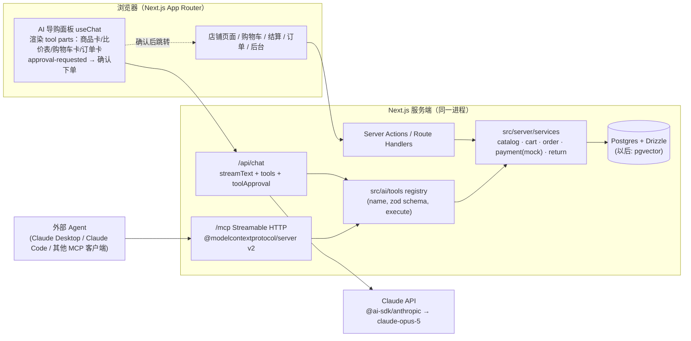
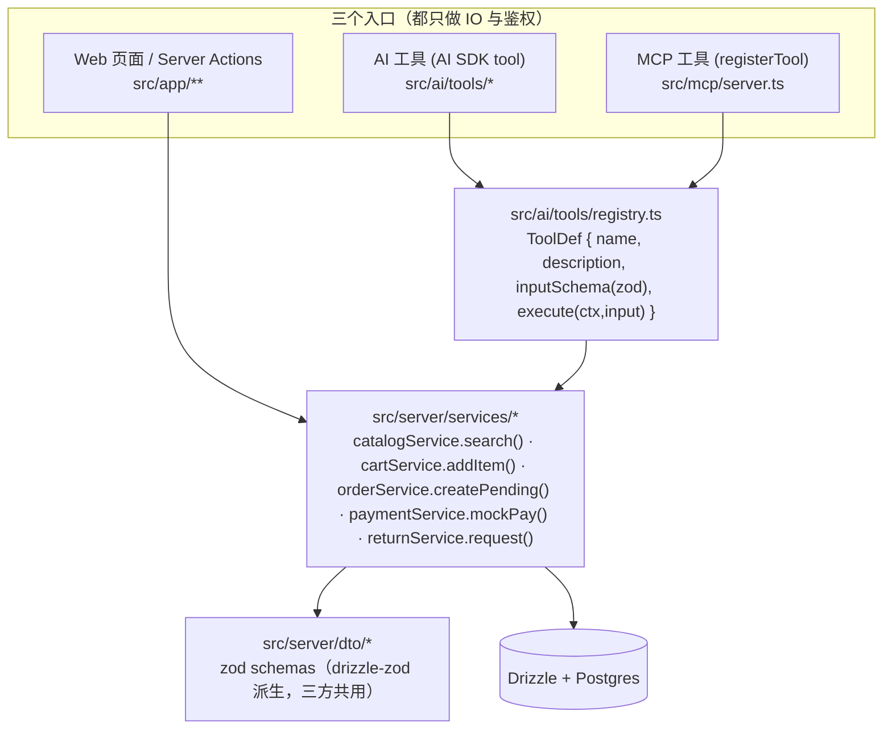

# 技术栈与开源参考调研（开源电商盘点 / 假数据 / 技术栈对比 / AI 层架构 / 部署 / 仓库结构）

> 文档状态：v1（2026-08-21 调研稿）｜所属：demo-e-commerce / docs/research ｜ 配套文档：[01-电商平台功能与用例调研](01-电商平台功能与用例调研.md)、[02-提效工具与 skills 调研](02-提效工具与skills调研.md)、[MVP 落地规划](../plan/01-MVP落地规划.md)
> 说明：star 数、版本号、最近推送时间来自 GitHub API / npm registry（2026-08-21 抓取）；「待核实」表示本次未确认。

---

## 第一部分：开源电商项目盘点

### 1.1 Headless / API-first 型

| 项目 | Stars | 最新版本 | License | 技术栈 | API | 官方 Next.js 前台 | 官方 AI / MCP 能力 | 对我们的参考价值 |
|---|---|---|---|---|---|---|---|---|
| **Medusa v2** | ~36k | 2.19.0（2026-08-13） | MIT（open-core，企业版另有许可） | TypeScript / Node / Express / PostgreSQL / Redis；模块化包（product / order / cart / payment…）；后台 React + Vite 7 | REST（Store + Admin） | 有（`create-medusa-app` 内置；`medusajs/dtc-starter`；旧 `nextjs-starter-medusa` 已弃用） | 文档类 MCP（需 Medusa Cloud 账号）；`medusajs/medusa-agent-skills`（Claude Code 插件）；Bloom AI 助手；无官方「店铺操作」MCP（社区有） | **抄数据模型与 API 命名**（Cart/Order/Payment/Fulfillment 模块边界清晰）；不直接复用（会隐藏内核） |
| **Saleor** | ~23k | 3.23.28（2026-08-20） | BSD-3（核心）；storefront 为 FSL-1.1；saleor-mcp 为 AGPL-3 | Python / Django / GraphQL-only / PostgreSQL；Dashboard React；Storefront Next.js 16 + React 19 + Tailwind | GraphQL | 有（`saleor/storefront`，Checkout v2） | 官方 **saleor-mcp**（只读：商品/客户/订单，托管 `mcp.saleor.app`，2025-11 上线）；ACP「ChatGPT Instant Checkout」beta；定位「AI-native commerce stack」 | 看 **GraphQL schema 的实体建模** 与 MCP 只读工具的取舍；技术栈与我们不同 |
| **Vendure** | ~8.4k | 3.7.2（2026-08-03） | GPL-3 + 商业许可（v3 起不再 MIT） | TypeScript / NestJS 11 / TypeORM / GraphQL；新 Dashboard React + TanStack + shadcn | GraphQL（Shop + Admin） | 有（`vendurehq/nextjs-starter-vendure`，Next 16） | 官方 CLI-MCP 已于 2026-04 归档；仅文档 MCP | 看 NestJS 分层与 Dashboard 的 shadcn 实践；GPL 不适合直接复用 |
| Commerce Layer | SaaS | — | 专有（SDK/CLI MIT） | 闭源后端；JSON:API | REST (JSON:API) | 无（demo-store-core 参考） | **Core MCP**（托管，读写，2026-06）；Metrics MCP | 看「Core MCP 读写工具」的设计 |
| **Sylius** | ~8.5k | 2.2.8（2026-07-31） | MIT | PHP 8.2 / Symfony 7 / Doctrine / API Platform；Twig 前台+后台 | REST (JSON-LD) | 无官方（社区 sylext） | 官方 **McpServerPlugin**（对话式购物：搜商品、购物车、结账、订单状态；仅游客模式）+ **AdminMcpServerPlugin**（171 个后台工具，OAuth2 PKCE） | **最值得对照的 MCP 工具清单**（买家侧 + 后台侧各暴露什么） |
| **Spree** | ~15.6k | 5.6.1（2026-07-28） | BSD-3（storefront MIT） | Ruby on Rails；REST Store/Admin API（OpenAPI 3.0）；`@spree/sdk` + `@spree/next` | REST | 有（`spree/storefront`，Next 16 / React 19 / Tailwind 4） | 文档 MCP、AGENTS.md、25 个 agent skills；宣称 API 兼容 ACP/UCP/MCP/Visa TAP | 看 **OpenAPI 规范** 与 Next.js storefront 的页面结构 |
| **Bagisto** | ~28k | 2.4.10（2026-08-21） | MIT | PHP 8.3 / Laravel 12 / Vue；REST + GraphQL（headless 包） | REST + GraphQL | 有（`bagisto/nextjs-commerce`，~6.3k stars） | 内置 **Magic AI**（多模型供应商：OpenAI/Anthropic/Gemini/Ollama…），文档 MCP，21 个 agent skills | 看「AI 生成商品内容」的功能边界 |

**小结**：
- 2025–2026 年所有主流开源电商都在补「AI 入口」：文档 MCP + agent skills 几乎成标配；**店铺操作型 MCP** 目前只有 Sylius（买家/后台双插件）、Saleor（只读）、Commerce Layer（读写）走在前面 —— 这正是我们 Demo 可以「小而全」地展示的空白。
- 对本项目：**不直接基于任何一个起步**（会把我们想展示的电商内核与状态机藏起来），但在数据模型（Medusa）、MCP 工具清单（Sylius / Shopify）、页面结构（Spree / Saleor storefront）上对照借鉴。
- 参考：https://github.com/medusajs/medusa · https://github.com/saleor/saleor · https://github.com/saleor/saleor-mcp · https://github.com/vendurehq/vendure · https://github.com/Sylius/McpServerPlugin · https://github.com/Sylius/AdminMcpServerPlugin · https://github.com/spree/spree · https://github.com/bagisto/bagisto · https://docs.commercelayer.io/ai/mcp/servers/core


---

## 第二部分：全栈/模板与国内开源盘点 · 假数据 · 技术栈对比 · AI 层架构 · 部署 · 仓库结构

> 调研日期：2026-08-22。Star 数 / 最近 push / License 来自 GitHub API 实时抓取；版本号来自 npm registry `latest` tag 实时抓取。未能核实处标「待核实」。
> 项目定位：展示 + AI 导购为核心的电商 Demo（Web 为主、单人、4~6 周、Claude Code 主力），核心电商链路（商品/搜索/购物车/下单/模拟支付/订单/最小后台）不缩水，并对外暴露 MCP Server。
> Headless 型（Medusa / Saleor / Vendure / Commerce Layer / Sylius / Spree / Bagisto）已另文调研，此处不重复。

### 0. 结论速览（TL;DR）

| 问题 | 结论 |
|---|---|
| 技术栈 | **方案 A：Next.js 16.3 单仓全栈**（App Router + Server Actions/Route Handlers）+ TS + Tailwind v4 + shadcn/ui + **Drizzle 0.45 + Postgres**（本地 Docker / 线上 Neon）+ **AI SDK 7 + `@ai-sdk/anthropic`（Claude `claude-opus-5`）** + **Better Auth 1.7** + **MCP TS SDK v2（Streamable HTTP）**；MVP 不做 monorepo |
| 数据源 | **DummyJSON（194 件/24 类，白底 webp 商品图）为骨架 → Claude 离线生成中文文案 + 多规格 SKU → 快照入库**；大目录演示再用 HF `milistu/AMAZON-Products-2023`（MIT、带图、带 embedding） |
| 开源参考 | UI 抄 `vercel/commerce`；数据模型抄 `macrozheng/mall`（pms/oms/ums）+ Payload ecommerce plugin；后台边界抄 yudao-mall 菜单；对话/工具命名对照 Shopify Storefront MCP（`search_shop_catalog/get_cart/update_cart/get_order_status`）与 Sylius McpServerPlugin（15 个工具、无人审批）；对话 UI 抄 `vercel/chatbot` |
| AI 层 | 8 个工具（search/get/compare/add_to_cart/get_cart/create_checkout/get_order_status/request_return）；`create_checkout`/`request_return` 走 AI SDK `toolApproval` 人确认；支付只在 `/checkout/[id]` 页面点击；MCP 复用同一 registry 白名单暴露；**MVP 不上 pgvector** |
| 部署 | 开发/离线演示 **Docker Compose**；对外 **Vercel + Neon**；国内直连可用 **Zeabur**；Cloudflare 留作 MCP 独立化的第二阶段 |

---

### 1. 全栈/模板型与国内开源电商盘点

#### 1.1 海外全栈 / 模板型

| 项目 | 技术栈 | Stars | 最近 push | License | 参考价值 | 备注 |
|---|---|---|---|---|---|---|
| **vercel/commerce**（Next.js Commerce） | Next.js App Router + RSC + Server Actions + `useOptimistic` + Tailwind + TS；后端 **只官方维护 Shopify**（Storefront API） | 14.2k | 2026-08-13 | MIT | **抄 UI/交互骨架**（商品网格、购物车抽屉、搜索/排序、`lib/shopify` 适配层模式） | 社区 fork 接 Medusa / Saleor / BigCommerce / Shopware / Swell / Wix / Umbraco / Ecwid / Geins / Prodigy / Fourthwall（各自独立仓库，替换 `lib/shopify` 实现）；另有 Orama（typeahead + 向量相似搜索）与 React Bricks 集成版 |
| **Payload Ecommerce Template**（`payloadcms/payload/templates/ecommerce`） | Payload 3.88（Next.js 原生 headless CMS）+ ecommerce plugin：Products & Variants / Carts / Addresses / Orders & Transactions / Guest checkout（email + accessToken）/ Stripe；Postgres 或 Mongo | 44.3k（主仓） | 2026-08-22 | MIT | **直接起步候选 #2 / 抄数据模型**（variants、guest order accessToken 防枚举、权限边界写得很规范） | 自带企业级 Admin，后台几乎零成本；缺点是 Payload 有自己的一套 Collection/hook 抽象，AI 层要在其外部另建 |
| **Kuzma02/Electronics-eCommerce-Shop-With-Admin-Dashboard-NextJS-NodeJS**（Singitronic） | Next.js + Node(Express) + Prisma + MySQL，含后台 | 683 | 2026-08-01 | MIT | 只看 UI / 后台页面清单 | 教学型全栈模板，活跃 |
| **MarcosCamara01/ecommerce-template** | Next.js 16 + TS + Tailwind（README 自述） | 228 | 2026-08-18 | MIT | 只看 UI | 版本新、小而干净 |
| **mehrabmp/kara-shop** | T3 Stack：Next.js + tRPC + Prisma + NextAuth | 379 | 2026-01-19 | MIT | 抄 tRPC/Prisma 分层写法 | 更新频率一般 |
| NextMerce/nextjs-ecommerce-template | Next.js 模板（商业公司开源版） | 294 | 2026-03-16 | 无 License 文件 | 只看 UI | License 缺失，谨慎复制代码 |
| w3bdesign/nextjs-woocommerce | Next.js + WooCommerce GraphQL | 607 | 2026-08-22 | AGPL-3.0 | 只看 UI | 后端 WP，不适合我们 |
| shopco 类 Figma→Next.js UI 套件 | — | 待核实 | 待核实 | 待核实 | 只看 UI | GitHub API 按名搜索未命中高 star 仓库，未能核实 |
| **medusajs/nextjs-starter-medusa** | Next.js + Medusa v2 | 2.8k | 2026-04-23 | MIT | 已 **archived**，只做参考 | 官方已迁移到 **medusajs/dtc-starter**（102★，2026-08-22 仍活跃，MIT）——一句话：若走方案 C 用 dtc-starter，不要 fork 旧 starter |
| **Evershop** | TS + Node + **GraphQL + React**，Postgres（官方文档），模块化插件架构，含 Admin | 10.4k | 2026-08-12 | **GPL-3.0** | 抄数据模型 / 抄 Admin 功能边界 | GPL 对 Demo 无碍，但不要直接嵌入代码到闭源项目；它的 product/variant/attribute/collection 模型是「中小电商刚好够用」的范本 |
| **Alokai**（原 Vue Storefront） | 前端即服务（FEaaS）：Vue/Nuxt 与 Next.js 两套 storefront + 统一 SDK/中间件接各电商后端 | 10.9k | 2026-06-09 | 仓库无 License 字段（核心已商业化） | 简述即可，不建议用 | 偏企业 composable commerce，学习成本高，与我们的「单人 MVP」相悖 |

**结论**：
- 「直接起步」的两条路：**A. 从零用 Next.js 16 单仓自己写**（推荐，见 §3）；**B. Payload Ecommerce Template**（后台白送，但 AI 层要绕着 Payload 写）。
- 「抄数据模型」：Payload ecommerce plugin（轻）/ Evershop（中）/ 国内 mall（重、全）。
- 「只看 UI」：vercel/commerce（交互范式最标准）+ 上面几个 Next.js 模板。

#### 1.2 国内开源电商（只抄模型与功能边界，不用 Java/PHP）

| 项目 | 技术栈 | Stars | 最近 push | License | 数据模型/后台清单价值 | 备注 |
|---|---|---|---|---|---|---|
| **macrozheng/mall** | Spring Boot + MyBatis + MySQL + ES + Redis + RabbitMQ；`mall-admin` / `mall-portal` / `mall-search` 三个服务；后台 Vue+Element | **84.6k** | 2026-05-14 | Apache-2.0 | **最值得借鉴的数据模型**：pms（商品/SKU/属性/品牌/分类）、oms（订单/退货/收货地址）、sms（优惠券/秒杀/专题/首页推荐）、ums（会员/积分）、cms 等表前缀清晰；`document/` 下有商品、订单的功能结构图 | 功能是「标准 B2C 单商户」，与我们 Demo 边界最接近；表太多，只取 pms_* / oms_* / ums_member* 子集 |
| **yudao-mall**（芋道，`YunaiV/ruoyi-vue-pro` & `yudao-cloud` 内的 mall 模块 + `yudaocode/yudao-mall-uniapp`） | Spring Boot/Cloud + MyBatis Plus + Vue3；前端 uniapp | 19.4k（yudao-cloud）/ 1.3k（uniapp） | 2026-08-14 / 2026-07-31 | MIT | **后台功能清单最全、最新**：product / trade(订单、售后、购物车、运费) / promotion(优惠券、秒杀、拼团、砍价、积分、分销) / member / pay；支持 SaaS 多租户、页面 DIY | 营销玩法对我们是「可选彩蛋」，Demo 只取 product + trade + member 的边界 |
| **lilishop** | Spring Boot 3.5.6 / Spring Cloud + ES + Vue + uni-app；B2B2C 多商户 | 4.3k | 2026-06-13 | AGPL-3.0 | 多商户店铺/结算/分销模型；功能清单是一份飞书表格 | 多商户对单店 Demo 过重；AGPL |
| **mall4j** | Java + Vue（仓库语言标 JavaScript，前端较多）；小程序/H5/PC/APP 多端 | 5.2k | 2026-08-17 | AGPL-3.0 | 多端商城模型、O2O/跨境 | 活跃但 AGPL，只看不抄 |
| **newbee-mall** | Spring Boot + Thymeleaf；前后端分离版 Spring Boot + Vue3 + Element-Plus | 11.6k | 2025-10-27 | GPL-3.0 | **最小可用的表结构**（商品/分类/购物车/订单/地址/轮播/配置 ~10 张表），适合对照「MVP 不缩水」的下限 | 维护转慢 |
| newbee-mall-vue3-app | Vue3.2 + Vue Router 4 + Pinia + Vant4 | 6.5k | **2023-05-29** | GPL-3.0 | 只看 H5 端 UI 流程 | 已 2 年未更新 |
| **CRMEB** | PHP ThinkPHP6 + Vue；小程序/H5/公众号/PC/App 多端 | 9.3k | 2026-07-13 | Apache-2.0 | 营销玩法（拼团/砍价/秒杀/积分/会员等级）与多端运营后台的「功能菜单」可作 checklist | PHP，不抄代码 |

**国内项目怎么用**：
1. 用 **macrozheng/mall 的 pms/oms/ums 表** 做我们 Drizzle schema 的「对照表」——尤其 `pms_product` / `pms_sku_stock`（SKU 规格用 JSON 存 `sp_data`）/ `pms_product_attribute(_value)` / `oms_order` / `oms_order_item` / `oms_order_return_apply`。
2. 用 **yudao-mall 的后台菜单** 做「最小后台」的功能边界 checklist（商品管理、订单管理、售后、会员、基础配置），其余营销模块全部砍掉。
3. 用 **newbee-mall** 校准「最小下限」：如果我们的表少于它，说明缩水了。

#### 1.3 AI-native / Conversational Commerce 开源参考

| 项目 | 内容 | Stars | 最近 push | License | 对我们的价值 |
|---|---|---|---|---|---|
| **vercel/chatbot**（原 `vercel/ai-chatbot`，仓库已改名） | Next.js App Router + **AI SDK** + Auth.js + Drizzle/Neon + Vercel Blob + shadcn/ui；Artifacts、工具调用、Generative UI；默认走 AI Gateway（支持 Anthropic 等多家） | 20.9k | 2026-07-08 | 仓库有 LICENSE 文件（类型待核实） | **对话 UI + 工具渲染 + 持久化会话的直接参考**；把它的 `tools/` 换成商品工具即可 |
| vercel-labs/ai-sdk-preview-rsc-genui | RSC 版 Generative UI 示例 | 384 | 2026-04-19 | 无 | **已 archived**；说明 RSC/`streamUI` 路线不再是主推，应走 `useChat` + tool parts 渲染（§4） |
| vercel-labs/bike-shop-agent | Vercel **Eve** 代理框架示例：工具 + 状态 + **human-in-the-loop（报价超 $150 需审批）** + Next.js dashboard | 8 | 2026-08-20 | 无 | 人审批范式参考（很新，star 低） |
| vercel-labs/agentic-commerce-skills | 「实现 agentic commerce 的 skills」 | 13 | 2026-02-04 | 无 | README 拉取 404，内容待核实 |
| **Shopify/shop-chat-agent** | Shopify 官方参考应用：React Router 后端作 **MCP Client 接 Storefront MCP**，模型用 **Claude**；主题扩展做聊天挂件 | 139 | 2026-06-09 | 自定义 | **工具命名对照**：`search_shop_catalog` / `get_cart` / `update_cart`（返回 checkout URL）/ `search_shop_policies_and_faqs` / `get_most_recent_order_status` / `get_order_status`；checkout 交给用户点链接完成 |
| Shopify Storefront MCP / Customer Accounts MCP | 官方托管 MCP：商品发现、购物车、店铺政策 FAQ、订单状态/退货 | — | — | — | 端点形如 `https://{shop}/api/mcp`（待核实）；把「支付留在 Shopify Checkout 页」这一点直接照搬 |
| **Universal-Commerce-Protocol/ucp** | UCP 规范：Capabilities（Checkout / Identity Linking / Order / Payment Token Exchange）+ Extensions（Discounts / Fulfillment），传输支持 REST / **MCP** / A2A；有 SDK、samples、conformance | 3.3k | 2026-08-22 | Apache-2.0 | 对外暴露店铺给 Agent 时的「术语与能力划分」参考；MVP 不必实现全协议，但工具命名可靠拢 |
| agentic-commerce-protocol（**ACP**，OpenAI + Stripe 维护，beta） | 2026-04-17 版加入 cart / feed / orders / authentication / **MCP** 绑定 | 1.5k | 2026-07-18 | Apache-2.0 | 同上，另一套事实标准；看 `rfc.agentic_checkout.md` 了解「Agent 下单、人确认支付」的交互模型 |
| **Sylius/McpServerPlugin** | 官方 PHP 插件：HTTP `/_mcp` + stdio；**guest-only**；15 个工具 | 19 | 2026-08-06 | MIT | 见下方工具清单，作为我们工具最小集的「对照组」 |
| NVIDIA-AI-Blueprints/retail-shopping-assistant | LangGraph 多 Agent（catalog retriever / memory retriever / chain server）+ React UI，需 4×H100 | 93 | 2026-08-21 | 自定义 | 架构图可看（多 Agent 分工），实现过重，不抄 |
| aws-solutions-library-samples/guidance-for-generative-ai-shopping-assistant-using-agents-for-amazon-bedrock | Bedrock Agents 版导购 | 20 | 2026-04-13 | MIT-0 | 工具/动作组划分可参考 |
| Hoanganhvu123/ShoppingGPT | RAG + Semantic Router 导购 | 158 | 2024-09-29 | MIT | 已停更，仅看思路 |
| Upsonic/UCP-Agent | 基于 UCP 的购物助手 | 14 | 2026-01-12 | MIT | 小样例 |

**Sylius McpServerPlugin 暴露的工具（对照用）**：`search_products` · `search_product_variants` · `fetch_product` · `fetch_product_variant` · `fetch_channel` · `fetch_currency` · `create_order` · `add_item_to_order` · `fetch_order` · `update_order_address`(步骤1) · `list_shipping_methods` · `select_shipping_method`(步骤2) · `list_payment_methods` · `select_payment_method`(步骤3) · `complete_checkout`(最终)。
特点：把 checkout 拆成 4 步工具、**没有人工确认环节**、仅 guest 模式。我们的差异化：checkout 必须 human-in-the-loop，支付只在 UI 完成（§4）。

**Shopify Storefront MCP 工具命名（从官方参考 app README 核实）**：`search_shop_catalog` · `get_cart` · `update_cart` · `search_shop_policies_and_faqs` · `get_most_recent_order_status` · `get_order_status`（Customer Accounts MCP）。Shopify 的做法是 **Agent 最多做到「给 checkout URL」**，支付永远在 Shopify 页面由用户完成——与我们的约束一致。

---

### 2. 假数据与占位资源

#### 2.1 公共假数据 API / 数据集（均已实际请求核实）

| 数据源 | 规模 | 字段（核实） | 图片 | 中文 | SKU/规格 | 评价 |
|---|---|---|---|---|---|---|
| **DummyJSON** `https://dummyjson.com/products` | **194 件 / 24 类**（beauty、fragrances、furniture、groceries、laptops、smartphones、mens-shirts、womens-dresses、sunglasses、vehicle…） | `id,title,description,category,price,discountPercentage,rating,stock,tags,brand,sku,weight,dimensions{w,h,d},warrantyInformation,shippingInformation,availabilityStatus,reviews[],returnPolicy,minimumOrderQuantity,meta{barcode,qrCode},thumbnail,images[]` | `cdn.dummyjson.com/product-images/<cat>/<slug>/1.webp` + `thumbnail.webp`，白底商品渲染图，质量好、稳定 | 英文 | 有 `sku` 但**无多规格变体** | **字段最丰富**；支持 `search?q=`、`/category/x`、`limit/skip`、`sortBy/order`、模拟 CRUD；另有 carts/users/auth |
| **Fake Store API** `https://fakestoreapi.com/products` | 20 件 / 4 类（electronics、jewelery、men's/women's clothing） | `id,title,price,description,category,image,rating{rate,count}` | `fakestoreapi.com/img/*.png`（亚马逊风格实物图，单图） | 英文 | 无 | 太少太简单，只够 Hello World；有 carts/users/login |
| **Platzi Fake Store API** `https://api.escuelajs.co/api/v1/products` | 50 件 | `id,title,slug,price,description,category{id,name,image},images[],creationAt,updatedAt` | `i.imgur.com/*.jpeg`（也有 placehold.co） | 英文 | 无 | **公共可写**，数据经常被改坏（实测 category 名为 "Updated Category Name"）；带 JWT/users/files/GraphQL，仅适合练 API |
| **HF `milistu/AMAZON-Products-2023`** | 117,243 行 / 37 类（Clothing 41.8k、Home&Kitchen 17.3k、Electronics 7.7k…），1.71 GB | parent_asin, title, description, price, average_rating, rating_number, **image URL**, main_category, subcategories, features, details, **预计算 embeddings**(text-embedding-3-small) | 亚马逊图 URL（外链，少量失效） | 英文 | 无规格 | **MIT**；源自 McAuley-Lab Amazon Reviews 2023；~31% 无价格、~21% 无主类目，需清洗 |
| **Kaggle `asaniczka/amazon-products-dataset-2023-1-4m-products`** | 1.4M 件 + categories.csv | `asin,title,imgUrl,productURL,stars,reviews,price,listPrice,category_id,isBestSeller,boughtInLastMonth` | 亚马逊图 URL | 英文 | 无 | License/更新日期待核实（Kaggle 页需登录看全）；只有标题没有描述 |
| 其他可选 | HF `philschmid/amazon-product-descriptions-vlm`（图文内嵌）、`Qdrant/hm_ecommerce_products`（H&M，图片字段待核实）、`Marqo/amazon-products-eval` | — | — | — | — | 备选 |

#### 2.2 AI 生成中文商品数据 + 占位图

- **生成**：用 Claude（`claude-opus-5`，或评估后换 `claude-sonnet-5`）+ **结构化输出**（`output_config.format` / AI SDK `generateObject` + zod schema）按类目批量生成：`name, subtitle, brand, category_path[], price, original_price, attributes{}, variants[{sku, options{颜色,尺码}, price, stock}], description_md, selling_points[], tags[], faq[]`。一次 20~30 件/类目，10 个类目 ≈ 300 件；用 Batch API 可再省一半。
- **配图方案**：
  - `https://picsum.photos/seed/<sku>/800/800`：稳定、可按 seed 复现，但是风景/人像，**不像商品**。
  - `https://placehold.co/800x800/f5f5f5/333?text=<商品名>`：纯占位，可写字，适合后台/骨架。
  - **Unsplash Source 已停用**；官方 API 需 key 且有 50 req/h demo 限额；可离线挑一批 Unsplash 商品类图存入 `public/`（注意署名）。
  - **最省事且最像店**：**复用 DummyJSON 的 `cdn.dummyjson.com` 白底商品图**（194 件、24 类、webp），把中文商品「挂」到这些图上（AI 生成时把英文 title/category 作为输入，让 Claude 给出对应中文文案和规格）。

#### 2.3 建议

> **推荐：DummyJSON 为骨架 + Claude 中文化/扩写 + 自建 SKU 规格**。
> 理由：（1）图片质量与稳定性最好、无需鉴权；（2）类目 24 个够展示「跨类目比价」；（3）字段已含 sku/dimensions/reviews/warranty/returnPolicy，可直接映射到我们的模型；（4）缺的「中文」和「多规格变体」由 Claude 一次性生成并落库到 `scripts/seed/data/*.json`（**离线生成、入库快照，不要运行时调 API**）。
> 若要「真实感更强的大规模目录」再上 HF `milistu/AMAZON-Products-2023`（MIT、带图、带 embedding）抽 2~5k 件做向量搜索演示；Fake Store / Platzi 不建议用于正式 Demo。

---

### 3. 技术栈候选方案对比

#### 3.1 当前稳定版本（npm `latest`，2026-08-22 核实）

| 包 | 版本 | 说明 |
|---|---|---|
| `next` | **16.3.2**（16.0 于 2025-10-21；16.3 于 2026-08-03） | Turbopack 默认、Cache Components/`'use cache'`、React Compiler 稳定、`proxy.ts`、React 19.2.8 |
| `react` | 19.2.8 | |
| `tailwindcss` | **4.3.3** | v4 CSS-first 配置 |
| `shadcn`(CLI) | 4.19.0 | |
| `drizzle-orm` / `drizzle-kit` | **0.45.2 / 0.31.10** | 仍 0.x，但 API 稳定 |
| `prisma` / `@prisma/client` | **7.9.1** | Prisma 7（Rust-free 引擎、Driver Adapters 默认） |
| `better-auth` | **1.7.1** | |
| `next-auth` | 4.24.15（Auth.js v5 仍在 `next-auth@beta`） | |
| `ai`（Vercel AI SDK） | **7.0.77** | `@ai-sdk/anthropic` 4.0.41、`@ai-sdk/react` 4.0.80、`@ai-sdk/mcp` 2.0.36 |
| MCP TS SDK | **v2：`@modelcontextprotocol/server` / `client` / `hono` 2.0.0**（对应 MCP 规范 2026-07-28）；旧包 `@modelcontextprotocol/sdk` 1.30.0 | `mcp-handler`(Vercel) 2.1.1、`@hono/mcp` 0.3.2 |
| `hono` | 4.13.3 | |
| `@tanstack/react-start` | 1.168.48 | |
| `vite` / `react-router` / `@sveltejs/kit` / `nuxt` | 8.2.2 / 8.3.0 / 2.70.3 / 4.5.2 | |
| `@libsql/client` | 0.17.4 | SQLite/Turso |
| `@medusajs/medusa` | 2.19.0 | |
| `payload` | 3.88.0 | |
| `typescript` | 7.0.2（Go 原生编译器版） | |
| `zod` | 4.4.3 | AI SDK / MCP SDK 均用 zod v4 |
| `@anthropic-ai/sdk` | 0.120.0 | Claude 模型：`claude-opus-5`（$5/$25 per MTok）、`claude-sonnet-5`（$3/$15，2026-08-31 前优惠 $2/$10）、`claude-haiku-4-5`（$1/$5）；4.6+ 用 `thinking: {type:"adaptive"}` |
| `turbo` / `vitest` / `playwright` | 2.10.11 / 4.1.11 / 1.62.1 | |

#### 3.2 方案对比（1=差，5=好）

| 维度 | **方案 A：Next.js 16 单仓全栈**（App Router + Server Actions/Route Handlers + TS + Tailwind v4 + shadcn/ui + Drizzle + Postgres + AI SDK + Better Auth） | **方案 B：前后端分离**（Vite+React 或 TanStack Start + Hono / NestJS / FastAPI） | **方案 C：Medusa v2 + Next.js Storefront + 自建 AI 层** | **方案 D（备选）：SvelteKit / Nuxt 4 / React Router v8 全栈** |
|---|---|---|---|---|
| 学习成本（Web 生疏 + Flutter 背景） | 3 —— 只学一套心智模型（RSC/Server Actions 有坑，但资料最多） | 2 —— 要同时学前端 + 后端框架 + 跨域/鉴权/类型共享 | 2 —— Medusa 模块/工作流/Admin 定制 + Next.js 两套都要学 | Svelte 3（语法最近 Flutter 声明式）/ Nuxt 3 / RR 3 |
| Claude Code 友好度 | **5** —— 语料最多、`create-next-app` 自带 `AGENTS.md`、shadcn 组件可一键生成 | 4 —— Hono/FastAPI 都很「Claude 友好」，但要维护两份工程上下文 | 3 —— Medusa 官方有 agent skills，但自定义模块/工作流的语料远少于 Next.js | 3~4 |
| 生态（电商 UI、模板、Auth、ORM） | **5** —— vercel/commerce、Payload 模板、shadcn/ui、Better Auth、Drizzle 全是一等公民 | 4 | 5（电商能力最全）但 AI 层生态为 0 | 3 |
| AI 集成难度（AI SDK、tool use、Generative UI、MCP） | **5** —— AI SDK 为 Next.js 原生设计；MCP 用 Route Handler + `mcp-handler`/`@modelcontextprotocol/server` | 4 —— Hono 有 `@hono/mcp` / `@modelcontextprotocol/hono`；前端仍用 `@ai-sdk/react` | 3 —— AI 层要另起服务，调 Medusa Store API；MCP 要再包一层 | 3 —— AI SDK 有 Svelte/Vue 适配，但 Generative UI 示例少 |
| 部署成本 | **5** —— Vercel 一键；或单容器 Docker | 3 —— 两个服务 + CORS + 两套环境变量 | 2 —— Medusa(Node+Postgres+Redis) + Storefront + AI 服务三件套 | 4 |
| 与 Flutter 背景衔接 | 3 —— React 组件 ≈ Widget 树，但 RSC/服务端边界要重新建立 | 3 —— 「Flutter 调 REST API」的熟悉感最强（后端 API + SPA） | 2 | Svelte 4（最像 Flutter 的响应式声明）|
| 单人 4~6 周可达成度（电商不缩水 + AI 导购 + MCP） | **5** | 3 | 3（电商快，AI/MCP 慢，且定制 Admin 费时） | 3 |
| 主要风险 | RSC/缓存心智、Server Actions 的错误处理 | 类型共享、双工程 | Medusa 升级/定制深水区；Demo 被框架绑架 | 生态与语料 |

#### 3.3 推荐与判断

**推荐：方案 A —— Next.js 16 单仓全栈（App Router）+ TypeScript + Tailwind v4 + shadcn/ui + Drizzle ORM + PostgreSQL（本地 Docker / 线上 Neon）+ Vercel AI SDK v7（`@ai-sdk/anthropic`）+ Better Auth + MCP TS SDK v2。**

理由：
1. 单人、单仓、单语言、单部署目标，是「4~6 周不缩水」的唯一可行配置；AI 层与电商层共享同一套 service/类型，MCP Server 只是多一个 Route Handler。
2. AI SDK v7 的 `useChat` + tool parts + `toolApproval` 天然覆盖「Generative UI + human-in-the-loop」；Claude Code 对这套组合的生成质量最高。
3. Better Auth（1.7）比 Auth.js v5（仍 beta）文档更完整、邮箱密码 + 会话开箱即用，也有 Drizzle adapter。
4. Drizzle vs Prisma：二选一都行。**选 Drizzle** 的理由是：SQL 透明（便于 AI 工具做结构化过滤/聚合）、无 codegen、`drizzle-zod` 可直接把表 schema 变成 tool inputSchema。Prisma 7 也已无 Rust 引擎，若更习惯声明式 schema 可换。

**要不要 monorepo？** MVP 阶段 **不要**。单个 Next.js 应用 + `src/` 内分层足够；只有当出现第二个运行时（例如独立 MCP Worker、Flutter 客户端要共享类型包）再升级为 pnpm workspace + turborepo（`turbo` 2.10 可无痛接入，目录预留 `packages/` 即可）。

**DB 选 Postgres 还是 SQLite？**

| 判断依据 | Postgres | SQLite（libSQL/Turso） |
|---|---|---|
| 商品属性/规格 JSON 查询 | JSONB + GIN 索引 | JSON1 可用但弱 |
| 中文搜索 | 默认分词不支持中文；MVP 用 `ILIKE`/`pg_trgm` + 结构化过滤即可，后续可加 `zhparser` 或应用层 jieba | `LIKE` + FTS5（需 trigram tokenizer） |
| 向量（以后） | `pgvector` 一条扩展 | libSQL 原生向量列（Turso），本地 SQLite 无 |
| 部署 | Docker 一行；Neon/Supabase 免费层 | 单文件最省；Vercel 上要用 Turso |
| 并发/事务（下单扣库存） | 成熟 | 单写锁，Demo 够用 |
| Claude Code 友好度 | 高 | 高 |

**判断**：**选 Postgres**（本地 `docker compose up postgres`，线上 Neon），因为我们明确有「以后可能上向量」「JSONB 存规格」「Drizzle 对 pg 支持最完整」三点；SQLite 只在「完全离线演示、连 Docker 都不想开」时作为备用（Drizzle 切方言成本低，schema 基本不变）。

---

### 4. AI 层架构参考

#### 4.1 AI SDK v7 与 Claude tool use 的对应关系

| 概念 | Claude Messages API | Vercel AI SDK v7（`ai` 7.0.x + `@ai-sdk/anthropic` 4.0.x） | 我们怎么用 |
|---|---|---|---|
| 工具定义 | `tools[{name, description, input_schema}]` | `tool({ description, inputSchema: z.object(...), execute })`（文档另一页写作 `createTool`，**写代码前用 context7 核一次 v7 签名**） | 每个工具 = `src/ai/tools/*.ts`，schema 用 `drizzle-zod` 从表派生 |
| 模型调用 + 多步 | 手写 `while stop_reason==='tool_use'` 或 SDK Tool Runner | `streamText({ model: anthropic('claude-opus-5'), tools, stopWhen: isStepCount(n) })` | Route Handler `POST /api/chat` |
| 流式到 UI | SSE 事件 | `toUIMessageStream()` + `createUIMessageStreamResponse()`（v5/v6 的 `toUIMessageStreamResponse()` 在 v7 文档中已是该写法） | 前端 `useChat()` |
| Generative UI | 无（自己渲染） | 消息 `parts` 里 `part.type === 'tool-<name>'`，按 `part.state` 渲染：`input-streaming → input-available → approval-requested → approval-responded → output-available / output-error` | 商品卡 / 比价表 / 购物车卡 / 订单卡 组件 |
| Human-in-the-loop | 应用层自己做 | `toolApproval: { create_checkout: 'user-approval' }`（服务端）+ 客户端 `addToolApprovalResponse({ id: part.approval.id, approved })`；客户端工具用 `onToolCall` / `addToolOutput`；`sendAutomaticallyWhen: lastAssistantMessageIsCompleteWithToolCalls` 自动续跑 | `add_to_cart` 走「执行后可撤销」；`create_checkout` 走「审批」；支付永不经模型 |
| 思考/推理 | `thinking: {type:'adaptive'}`（4.6+；`budget_tokens` 在 Opus 5/Sonnet 5 上报 400） | provider options 透传 | 导购对话默认开 adaptive，可用 `effort` 调深度 |
| 结构化输出 | `output_config.format` | `generateObject` / `Output.object` | 离线生成商品数据（§2.2）|
| MCP 客户端 | `mcp_servers` + `mcp_toolset` | `@ai-sdk/mcp` 2.0.x | 以后让我们的导购也能接外部 MCP（物流/比价）|

#### 4.2 工具最小集合（同一份定义复用到 Web/AI/MCP）

| 工具 | 输入（zod） | 输出 | 副作用 | 需确认 | Generative UI |
|---|---|---|---|---|---|
| `search_products` | `{ query?, category?, priceMin?, priceMax?, attrs?, sort?, limit }` | 商品摘要列表（id/name/price/thumb/rating/keyAttrs） | 无 | 否 | `ProductGrid` 卡片 |
| `get_product` | `{ productId \| slug }` | 商品详情 + 变体/SKU + 库存 | 无 | 否 | `ProductCard`（可选规格） |
| `compare_products` | `{ productIds: string[2..4], aspects? }` | 对比矩阵（结构化） | 无 | 否 | `CompareTable` |
| `add_to_cart` | `{ skuId, qty }` | 购物车快照 | 写 cart | **否**（执行后卡片上给「撤销」）| `CartCard` |
| `get_cart` | `{}` | 购物车快照 | 无 | 否 | `CartCard` |
| `create_checkout` | `{ addressId?, shippingMethod?, note? }` | 待确认订单草稿（金额明细） | **生成 pending 订单** | **是**（`approval-requested` → 用户点「确认下单」）| `CheckoutConfirmCard` → 确认后跳 `/checkout/[id]` 由用户点「模拟支付」 |
| `get_order_status` | `{ orderId? \| latest: true }` | 订单状态/物流时间线 | 无 | 否 | `OrderStatusCard` |
| `request_return` | `{ orderId, itemIds, reason }` | 售后单草稿 | 写 return | **是** | `ReturnRequestCard` |

对照：比 Sylius 插件少了 channel/currency/shipping/payment 四步拆解（我们把地址/配送收敛到 `create_checkout` 输入，支付干脆不给模型），比 Shopify 多了 `compare_products` 与 `request_return` 写侧。

#### 4.3 对外 MCP Server

- 用 **`@modelcontextprotocol/server` 2.0**（`McpServer.registerTool(name, {description, inputSchema}, handler)`）+ **Streamable HTTP**；在 Next.js 里以 Route Handler `app/mcp/route.ts` 暴露（Vercel 的 `mcp-handler` 2.1 即为此封装；stateless 模式最省事）。SSE 传输已是旧规范路径，不再新做。
- **同一份 `src/ai/tools/registry.ts`** 导出 `{name, description, inputSchema, execute}`，分别适配成 AI SDK `tool()` 与 MCP `registerTool()`；MCP 侧 **只暴露只读 + 购物车 + create_checkout（返回 checkout URL）**，`request_return`/支付不暴露。
- 认证：MVP 用 `Authorization: Bearer <api key>` 或匿名 guest session（参考 Sylius「guest-only」与 Shopify「返回 checkout URL」），OAuth 以后再说。

#### 4.4 要不要 pgvector？

**MVP 不上向量。** 判断：（1）商品 ≤ 500 件、类目 ≤ 30，`ILIKE`/`pg_trgm` + 结构化过滤（类目/价格/属性）+ 让 Claude 先把自然语言**改写成结构化查询**（工具参数）效果已很好；（2）中文分词问题在向量方案里一样要解决 embedding 模型选择；（3）上向量要多一个 embedding 服务与索引维护。
**何时再上**：商品 > 2~5k、出现「像这种风格的」「适合送长辈的」等语义查询明显失败、或要做「以图搜图」时，加 `pgvector` 列 + Voyage/OpenAI embedding（HF 数据集自带 embedding 可直接演示）。

#### 4.5 推荐最小 AI 架构图



**关键约束**：支付按钮只存在于 `/checkout/[id]` 页面（Server Action 调 `payment.mockPay`），任何工具都不能触发支付；`create_checkout` 只创建 `pending` 订单并返回确认卡片/URL。

---

### 5. 部署与运行

| 方案 | 组成 | 优点 | 缺点 | 费用（Demo 规模） |
|---|---|---|---|---|
| **本地 Docker Compose** | `postgres:17` + `app`（多阶段 Dockerfile，`next build` standalone） | 离线可演示；与线上同 schema；Claude Code 可直接跑 e2e | 只能本机/内网看 | 0 |
| **Vercel + Neon（或 Supabase）** | Next.js 原生托管 + Serverless Postgres | 零运维、预览环境、AI SDK/MCP handler 同厂最顺；Neon 免费层够 Demo | 函数时长上限（长对话流式一般 OK，Hobby 计划有限制，具体配额待核实）；国内访问需梯子 | 0（Hobby）|
| **Cloudflare Workers（OpenNext）+ D1/Hyperdrive + Workers AI（可选）** | Workers 跑 Next.js（通过 `@opennextjs/cloudflare`）；D1=SQLite 或 Hyperdrive 连 Postgres；Agents SDK 做 MCP 很顺 | 全球边缘、便宜、**MCP/Agents SDK 体验最好**（Durable Objects 保持会话） | Next.js 16 在 Workers 上兼容面需验证（OpenNext 适配滞后是常态）；Node API 限制；调试链路长 | 0~$5/月 |
| **Railway / Fly.io / Zeabur** | 容器 + 托管 Postgres | 最接近 Docker Compose，**Zeabur 对国内网络友好**、有中文文档 | 免费额度小（Railway 试用额度、Fly 需信用卡） | $5 级 |

**Demo 阶段推荐**：
1. **开发/演示默认：本地 Docker Compose**（`docker compose up -d postgres`，app 本机 `pnpm dev`），保证离线可演示。
2. **对外链接：Vercel + Neon**（最省事，AI SDK、MCP Streamable HTTP 均原生支持）；若需要国内直连演示，**Zeabur** 跑同一个 Docker 镜像 + 其 Postgres。
3. **Cloudflare** 作为「第二阶段」选项：当 MCP Server 要独立、要长连接/会话状态、要 Workers AI 做 embedding 时，把 `src/mcp` 抽成独立 Worker（Agents SDK 的 `McpAgent`），主站仍在 Vercel。

---

### 6. 仓库结构建议（单仓 Next.js 16）

```text
demo-e-commerce/
├── AGENTS.md / CLAUDE.md            # 给 Claude Code 的项目约定（分层规则、命令、禁止事项）
├── docs/
│   ├── research-*.md                # 本调研及 headless 调研
│   ├── adr/                         # 架构决策记录（为何 Drizzle/Postgres/无 monorepo…）
│   ├── data-model.md                # ER 图（Mermaid）+ 与 mall pms/oms 的对照
│   └── ai-tools.md                  # 工具清单、确认策略、MCP 暴露面
├── docker-compose.yml               # postgres(+ app)
├── Dockerfile
├── drizzle.config.ts
├── drizzle/                         # 迁移文件（drizzle-kit generate）
├── scripts/
│   └── seed/
│       ├── generate.ts              # 调 Claude 生成中文商品 JSON（离线、一次性）
│       ├── data/*.json              # 生成结果快照（入库用，提交到 git）
│       └── seed.ts                  # 写入 Postgres
├── public/                          # 静态资源 / 少量本地商品图
├── src/
│   ├── app/                         # 路由层（只做 IO：解析参数 → 调 service → 渲染）
│   │   ├── (shop)/                  # 首页、/products、/products/[slug]、/search、/cart、/checkout/[id]、/orders
│   │   ├── (account)/               # 登录/注册/地址/订单
│   │   ├── admin/                   # 最小后台：商品、订单、售后、基础配置
│   │   ├── api/chat/route.ts        # AI 导购：streamText + tools + toolApproval
│   │   ├── mcp/route.ts             # 对外 MCP Server（Streamable HTTP）
│   │   └── api/auth/[...all]/route.ts  # Better Auth
│   ├── components/                  # UI（shadcn/ui 基座 + 业务组件）
│   │   └── ai/                      # 商品卡/比价表/购物车卡/订单卡/确认卡（Generative UI 专用）
│   ├── server/                      # ★ service 层（纯 TS，不依赖 Next）
│   │   ├── db/{schema.ts,index.ts}  # Drizzle schema & client
│   │   ├── services/{catalog,cart,order,payment,return,member}.ts
│   │   ├── dto/                     # zod 输入/输出 schema（drizzle-zod 派生）
│   │   └── errors.ts
│   ├── ai/                          # ★ AI 层
│   │   ├── tools/{search_products,...}.ts   # 每个工具：name/description/inputSchema/execute（只调 services）
│   │   ├── tools/registry.ts        # 工具注册表 + 两个适配器 toAiSdkTools() / toMcpTools()
│   │   ├── prompts/shopping-assistant.md
│   │   ├── agent.ts                 # model、system prompt、toolApproval 策略、stopWhen
│   │   └── ui-parts.ts              # tool part 类型 ↔ 组件映射
│   ├── mcp/
│   │   ├── server.ts                # McpServer 实例：从 registry 注册（白名单）
│   │   └── auth.ts                  # Bearer/guest 会话
│   ├── auth/                        # Better Auth 配置 + Drizzle adapter
│   └── lib/                         # 通用工具（money、slug、zod helpers）
├── tests/
│   ├── unit/                        # services、tools（vitest）
│   ├── e2e/                         # playwright：搜商品→加购→确认下单→模拟支付→查订单
│   └── ai/                          # 工具调用回归（固定 prompt → 期望工具/参数）
└── package.json                     # pnpm；脚本：dev / db:generate / db:migrate / seed / test / e2e
```

**Service 层如何被三方复用**：



规则：
1. `src/server/services` **不 import** `next/*`、`ai`、MCP SDK；只接收 `ctx = { userId | guestId, locale }` + 经 zod 校验的输入，返回纯数据；所有事务（扣库存、下单）在 service 内完成。
2. `ToolDef.execute` 只做「参数整形 → 调 service → 裁剪成对 LLM 友好的精简 JSON」；同一 `ToolDef` 被 `toAiSdkTools()` 包成 AI SDK `tool()`，被 `toMcpTools()` 包成 `server.registerTool()`；MCP 用白名单过滤掉 `request_return` 与任何支付相关工具。
3. `paymentService.mockPay()` 只能从 `/checkout/[id]` 的 Server Action 调用（代码层面不进 registry），保证「支付永远由用户在 UI 点击」。
4. Web 的 Server Actions 与 AI 工具共用 DTO/zod，前端表单校验与模型参数校验一致，Claude Code 改 schema 时三处同时受益。

---

### 7. 参考资料 URL 列表

**全栈/模板**
- https://github.com/vercel/commerce
- https://github.com/payloadcms/payload/tree/main/templates/ecommerce
- https://github.com/medusajs/dtc-starter （旧 starter 已归档：https://github.com/medusajs/nextjs-starter-medusa）
- https://github.com/evershopcommerce/evershop
- https://github.com/vuestorefront/vue-storefront （Alokai）
- https://github.com/Kuzma02/Electronics-eCommerce-Shop-With-Admin-Dashboard-NextJS-NodeJS
- https://github.com/MarcosCamara01/ecommerce-template
- https://github.com/mehrabmp/kara-shop
- https://github.com/saleor/storefront

**国内**
- https://github.com/macrozheng/mall
- https://github.com/YunaiV/yudao-cloud · https://github.com/yudaocode/yudao-mall-uniapp
- https://github.com/lilishop/lilishop
- https://github.com/gz-yami/mall4j
- https://github.com/newbee-ltd/newbee-mall · https://github.com/newbee-ltd/newbee-mall-vue3-app
- https://github.com/crmeb/CRMEB

**AI-native / 协议**
- https://github.com/vercel/chatbot （原 vercel/ai-chatbot）
- https://github.com/vercel-labs/ai-sdk-preview-rsc-genui （archived）
- https://github.com/vercel-labs/bike-shop-agent
- https://github.com/vercel-labs/agentic-commerce-skills
- https://github.com/Shopify/shop-chat-agent · https://shopify.dev/docs/apps/build/storefront-mcp
- https://github.com/Universal-Commerce-Protocol/ucp · https://ucp.dev
- https://github.com/agentic-commerce-protocol/agentic-commerce-protocol · https://agenticcommerce.dev
- https://github.com/Sylius/McpServerPlugin
- https://github.com/NVIDIA-AI-Blueprints/retail-shopping-assistant
- https://github.com/aws-solutions-library-samples/guidance-for-generative-ai-shopping-assistant-using-agents-for-amazon-bedrock
- https://github.com/Hoanganhvu123/ShoppingGPT · https://github.com/Upsonic/UCP-Agent

**假数据**
- https://dummyjson.com/docs/products
- https://fakestoreapi.com/docs
- https://fakeapi.platzi.com/en/rest/products/ （base: https://api.escuelajs.co/api/v1）
- https://huggingface.co/datasets/milistu/AMAZON-Products-2023
- https://www.kaggle.com/datasets/asaniczka/amazon-products-dataset-2023-1-4m-products
- https://huggingface.co/datasets/philschmid/amazon-product-descriptions-vlm · https://huggingface.co/datasets/Qdrant/hm_ecommerce_products
- https://picsum.photos · https://placehold.co

**技术栈文档**
- https://nextjs.org/blog （16.0 / 16.1 / 16.2 / 16.3 发布说明）
- https://ai-sdk.dev/docs/ai-sdk-ui/generative-user-interfaces · https://ai-sdk.dev/docs/ai-sdk-ui/chatbot-tool-usage
- https://github.com/modelcontextprotocol/typescript-sdk （v2：@modelcontextprotocol/server|client|hono）· https://github.com/vercel/mcp-handler
- https://orm.drizzle.team · https://www.prisma.io/docs · https://www.better-auth.com/docs
- https://tailwindcss.com · https://ui.shadcn.com
- https://platform.claude.com/docs （模型：claude-opus-5 / claude-sonnet-5 / claude-haiku-4-5；adaptive thinking）
- https://developers.cloudflare.com/agents/ · https://opennext.js.org/cloudflare · https://neon.tech · https://zeabur.com
